# はじめに

この記事では、正規表現や言語処理系のしくみ、型レベルプログラミング等について理解しながら、TypeScript の型システム上で動作する正規表現処理系をつくることを目指します。この記事の内容を完了すると、以下のような型をつくることができます。

```ts
// 正規表現文字列から TRegExp 型を作成
type EmailRegExp = TRegExp<"^.+@.+\\..+$">;
// 正規表現にマッチする文字列であれば true 型になる (ValidEmail: true)
type ValidEmail = TRegExpTest<"piyo@hiyoko.com", EmailRegExp>;
// マッチしなければ false 型になる (InvalidEmail: false)
type InvalidEmail = TRegExpTest<"piyo.com", EmailRegExp>;
```

今回の実装内容は [こちら](https://www.typescriptlang.org/play/?ts=5.8.3#code/PQKgBApgHghgtgBwDYTCYAoDxhkMbWg8ZGAWEYH-Og4aaDq2oOhKg0gyCRDGACoBKEA5gKJQJiDR6oEkMgHXlACEYYALgE8EqDnBgBLJK07cwAXibKuCADwAiAHoA6ANQABUwB1LR0wBI9APgDc2XIVKBrBkB7DIGGGQIMMgJoMgNEMlFSA5gyAQgyAMQyADgxgYgBOAK6ovJ6AVgzBYAAUAGowSPIAJrIKSABcCSkQAJTiUqgFRaVyiuqa7NqMEADOYvoI8hIA9mYAFsMjANYjRgDGI3B6ADRgZYpa3C5uYH7+gOoMGYCKDHFgAGaFvWmZ2TkAkgB2AG6FJRuVF1d1DdJgT68Wh8Oiwutwev1BlMFktVus2kowQgdlhsOBkmJFL00JhfqgACLyc7nHQAZUgUDEEEexWxyUe00eIwA7o8ANoAXTWjApVJpdIZTNZnMcHUJxKeVMSj0KZO5KMkf3F50lEGlsowYDA5OgfNpYHpjJZ7K5mqYvOp+sNQpNKzNrF6ySQYgt-INguNnI6nIwoo0OspluxbPkj3OarAAAkIDBimtbEZQ+HEkxyhyzQB+dZQeT9Xo6RhraOx0W6oPVVJmrVZ5Wq9VIAvlblrB1OsSOKtgKq1x5SmUNxhNphrNkJ1vOosx4ocjtaqrjsSuPHrACOyVlAA01gBNP25AuOHK1dSinllt0bsBZgCMXbAACZj+f9TozYxfUeT+bn9jt1ewLeVT3pmFYQGaVSXEg1xLoqMg5nmBaulaHrClyYAAKp7megZumyZpJhGxZxmaCYESmg6KBg6bVqu64NkRayYUh2JJJWWo0axYHsXeXC5mI+YUUgjGznekHQVgsH-L2arXPMmIjI8r5agGeoCkaqF2lq2Gqe66kmr6HR1rJ8mPHW-ZykwCqNFJUrGfIClmRqynMbpNqcpp344chenufafRti51qehy3rpnuKnliGYaEVO8a2GRqaKNR-68QhhZRlOpZeSxNSdlmRkQHJ9mmdJ9aNoozZgKOtgLpOsYzp2VQFUVDmleZgmVQuInzv5zowdZAAyMCQtp5ZBahWEudVibRSmAD6awJUN-TJVmy1iOBYCPBAzxqv1fzoY88hrhAiE-q5wV7odx2pI5A5WQdR0nXdSmeTp422n5jrOoFKEmqFBkaKNuEJQxYCkbNiVIKtGWxi5C5so8yRwAARmqyU0ddz1tbKHVgF1jUYU9t04wOQ7TbVsPTt1+O9YuqJogkMzUjiEnWYwzOPB0ADeCSNFU-SJKGbBgAAvvtqAc9M1IDQACjAiQs0DnNgAAZGAvOwVUehywAgswHAAHJ6GLriSVL1LMPLitc8r0tc+rmv82AehW-rRsm+Ly4W4810KSCKuO3z0ja+hhv3AA8sbpve5zstIMk2J2yzQday7ssDehpKe2b7Oc6SYgKwH9tqxrwcQNrpKMPrOex-bEcICZxcp2Xad6BHsuMJH0de+bnP4iMLrJw7rfO3o+IR4wtd9-bADC4wKzos8uYLwtYYHo8hy7s+RjXzhgPMC+JFUy+93n9u648h8jIkBcK0PTAb07W96Lrhs7xHzBzVX+tTzHM-UkvtfRIHAaTNxHs-CuLs34fy-kbfEtc67UgALIwB4BobmZo9A5D0FUH2csFbUlcFqPQtRcGP3tlbQhjxiEuwAD7kJ9n7GhWCTCMLjgnXotC9AgHYfbO+iRuEZj4dSBuJluFGBEY8Ae9MSEGCkUA8YN8BGyLAHYPBnNFE31AcUVwXtUSgDACgKAEZ0Bsz+ANaAaoyQrySGvDoliTGJBeqSB6qBHFqhemaCKbpV6PDYB5H22Jzo+y9BoH04UXIAAM7Dc1BlOUWsSEqCVFlEkCREXLS1GOcChKC0F5TAB45xpNypCSqgmIJ3JOaoIQGyIiHIGrcSqBk86ehrB6AKYJaJSTIYcF6PMNBEBijzwVokuJvT+mDOKCktJ3EaJFJen0gZ0hpnkwqZzXoVS55Hx0EsqZIzEiOEaXMqo21dqJEJi07KYA-FsAKQskpeNpqVNyY8A5OgiJHJEnOLaO01SbUwXMpm9tegaJBbQrU+jJJFIXDzM0YgNlgupJyPRS4sCGOGi6Mxy5dZV0NiMYoqAMFgBKALOx-j95p1uTHHFeKCUQGYCMQe9xigdD0AAYj0LnP4uLGD4sJYyweS9JhIFZedXl-KiVgAlfSvcMrCWl0BSS4oVR5UMqZWIFltC27MAjpPLlZpD6KBVWAeexrUXmNQGq5hLKdDW2pJqsV1y1Vsj0CUPQM4OgxO5va3sLLRbJCidyq1dLCU2uKANO11DHUuRdW64oHq9zet9Y6gNABaJAQbaV8vpeG5gUabYxvFaGiArr3Weo0Mm6N-rkhpsSFmyS1qjoKVeimllsaS1loTSFDQcby0eQGma0VHac0Kt7SWjyzAh1Op0mqjoarAbSpLYq-CJqm3FVtW24oOwtRtzDt3A1WoUDnDEFUQdIrdFmiFmwcYp78bTotdmyVs8FIDMdQWh17bi2jtLfGxNXrYlbtFvMBt1k1UvqvjAR1kat0jslV2-9lbAPVuKMBjNoGeUlog2+ll+bYPfvg3+itYAq2Fv9fMOtGGQ0-uw1B1tKG4P0oQz2pdP7mMDunYxsdrHJWTs4wR+l86S2LrnY7VdqqsOvqg5ulDO7y7a1nlHWeusp60OPXe895qr3yBvXeqdF7H2NpLfHROMmyMzvLH27tSbkPmdFggKjPH6UmfzGafDzrO1EaE2xojHl+MeZ-d5yVInl1ia1KSpzhKXNmc-du7VY8M5Z0PQfC9J8DMYChWBktAiYt+os26KziGSO2di6LXojm1UCPo+Zrjv7y1BaY75s0-nZ3LvHT+kLgWwvKokz+nLxQP15bk23H+zBktGtFWlrTmXMM-rERugb7nWs+fLTZn1KHRYjAqyW+bLa3MMYE4S5jDWjtNa1C1yzbXItgTlaFjW4nru7dMot2T8WX4dy7lHcbqXTXpZm9RyVMjctFoC4R1bAH1t2eKNtn9MjBsg+W2D7tJ26vWfUGaUT93uIRbVUDl75m5O7rHhPVTZp-vXYOba-bNXDuo49X5o+tihb+MXaR0rFHYkHNFmmmHz6dnU9i7V477Wkf0+a4z861KNC3M65Kld4W11YaPsDllawDnDbHjvPehqj5pYVoZrLP7rbXA4IkRIN8Ufy56y7dlapzeJGS23DgzBdVjcfei8ACAFbXBTNiySxvrFBJcqEit1PrhPYLBsrKOkEoB6e7C86Srd2IteSizsIxG7FTwVsBAT3aGiwKUnuZmLeuSsFQMTsQKA-MO0IkHQary+q7AHHzPCkEZ6ARSCxNlf2KE7mRnkyVQW8mXbwP4qHqIXsQL00355yJbN+92qWFGCzQl+u+X2hY+FLZ6RHnjL8-h-FVekHkJnNfJaie8HnPl+MEF-XiCqaPstG30LokMQcUZrJlpv0YPZ+GkgUPxbQdHfzAEvyDhgCviURf3viqE4jFhphP2uWmgSmAN-3tncleWfx0RhkAMUmALWDALLggOAR0VgJqHgIBR7072pFBVeS4R7y30eCqD324n0RwDAB0HpGKjTWgAQEOS7AqA0B0EWEgzEB4O4H4P3Sjg4K4IUnEL4NFDoQ4JELfXkMOWXGr2bUeFr2q0F0l3JQCTfA2TQORVNC1EsRPUQJ0hDwBnvxoKmniThlP3tg-2SXKBMJNBhjwir0X1ozEB0PXQcgjXhxZUcDWAsLECCTCJ7wYh700OKgCJLTzRCO3W5HKG+TABCnOm8LmVj18Kk38IkIT1B3pQ8m4iYS0LKPYjyMSGuBryKLplq07Axn-DZADz8Nr0pniIUk6LpiyOyh7y1CULZDVQD1N3tzWA+haO4mGI+jWFGMX3GJvmmP-G6O0IkJSLSIqnKVsAiJeXqQyJ+UCMUi3TWHaIKN6O+hALWMuLbAyKH0X3qL4M2KhhHATD2I2Tqmpk2nONEJ0NOMKQgEsKjyXHYOEIKLUNFAqEEI4OQETkhOUIhN4P4KUJ0DhN6EhI0PyL+I2IFzyyZ2FkCWMOcNMIHSBMiOJOuRsPCTCnAWCSQMcPy31B9lcMhi6RJM8JAhyO4gDxc0SJowKJZRg1kzeN2PJP2KnBnCqK1F+LfX5OfUFOKDwxFKhgyP6J0m5OqMhl5M4VuJ+lp2lJJW1OxLlIaKuKaO4haKzDaMXz5LNLbDOJNKgz1LEHVKDEGLAGGIWNqIgCWMSEmL+hWKGKqjmOuzGLN2WJ7yzFlOdI2IBKeXePFM+KpmORn3AwKJeJ1MThdMdJ9I6PtOdHuIXzzIuLjJQy2LKWmg+JBS+OOQeJ9LtOeIBOrJoJRDBPRIROhKEMuDkhvgRMS3JFRP6AVkxP91tN1NxJlIO2uVuSJIfw5IiTpKmghi-wADEYBezEgrDywQ8tlqQXMcDF91zNydCe9RjOEVdUie9jyEUtyNlOxo9ywajrgbztECyXRacCkA9XyQF3zatwz7cozizrgBF-jyy6DDi7xzzE5MyjyNzbyXSiyA9QKyzzM9zHhegaZkLX8wK0KILQTcAdBhzEhOyYSdAezbyETRtPSODGDRzrJsKFZTypyacZyDC5z7CFzaTh56SNSVyIwfzty3RdzXkBFDyfSfzmK5lKtX9LzoigVBL7zuJHy3RnyIBJK-zPzuJoy4KTzNKSiotFiIyLkgUdKfSntcLYt0LMKe9S96UqsATvz4K3y+CCYZ9cDLK8trKsLF8LLUKrL8L0VCK6LkSoSyKKK+zQrQDO5u4aLyLnKSLQqsTzLW91jni8SEdyxZyjD5yqS-9F0hL9RkDIZFLcrrC-90KntxKXyEqpLuI1Uns5LDTSqaCHyXI1KNLXLGitL2IzKaq9KurzTacAKb4gKnKBq694yo9bLHtUrYKJLar3ykLdKEL-KvKIKfiVqXLJrwKoiCKOCIrEqJCwqNA9YDZDYZCtCES3ZzqaKScaKtdmAcgoB6gxyFqJrdD8T9DmdDCtJKTyr0DuK6CpocqZZfUPJ+KUxmFCrsRdzQbHgqEbYqIQJob-rIorSKcdkAS9AnBCYbi1rHVGItCojNoYaqofYZEYZcchUt0EC0bcIfZ3kEoDkCT-EjkQJwMsbwL1dNpvSTdjK0VGYwwYBWZlxDZVzcVC4qQOhblg11gEBegWaNAkYkAkB59xaVNEgIDeh5Am4V8tRzhzc4AqgNa74qRtURgTaJazaIBaFD4FYyUfqaKOAFaDkDc-gNa4UtRhyqRaDTapbS0ORtUtaMLdbio-aJbGAQ6daTI09vbX871-aoNbbV95h5gIBG4rbJbk6099EPctpLg00UZkhjVTFcRJINaAAhEu0VaxOXWncvPcJVYWrO6u0u4pPsWUSVHYcnKumuwlRIZfLHAumALO921APu9ul6eugyiAPcGexHelcvECSe2ujutUcyQjCbazTaBey7H9ZhFeiWtute5hHQbu3ewTWnPwo+3WE+gevw8+2VS+hVYazhW+++tUFzJ+wlGmPegrbLV-D+-utUKrC+n5f+-UBq1K4B9uiPcBu8SB7EamjaGiVegeuHBBk2q+2eg5WBte95LB2fPaS1MAdBtUM+s0JB67ZhAdT286T2jQch9esqQjdTRNSdeh65Rhsh4+kBlhzexra9W9bvJus0H2voKoKsjW11CR3oencGGqGRvQORhR71UXDkUWMwAABiiSDvhWjrDoUloM1PeOUaSG1qMYwrF24jHHMcMZMnkbMPYl5kNqWCqHUca3LS0d0cpUtsKWUeIrEAnxSwdvlsVsZ1FiqNcaNo8diQ0Z8aDSZnnECYTpCftuPnCZZun0yNoSCbie5gSZ0azS1A3PTszp2KMAGmUbKYzuCbQjsYltdVqcbg9X0d7r4fbsfqoZwcXsJT8LoYlpch4eYensa3YalPtC4Z0hGc6bXrGdO2EfqY7DEfjuTpMbMaaZUYDqcY-2YFSfWbaeDssccakc7E2d1ldQsdDscZsfYkacuY7wcfDrua1AqWeeMdXKNptvzGqa2ZafqZbAObfwUZdoiYVhEn0bWbfzPWBfqdoQBZSf+bTrqYn331IeYe-p6dftnpcz82mfLFmbvv4YWd-W3tEa9puR2ZPgOd9rRd3Q+YwrOdsdsFnnsZOZeecbedsCjo5c+e+Z2aXhqZRdabQjZa2aCdBddqPkhbyYTppYlbSahbAERdNWFfKfhfRbFrmYHqq2xdQFpwEXxaGYYaGaYZ1c8RKS3ovQpf1qpfWYVcedUeVeuZjvDuZfudZfZZuc5aqPeb5Ywq+aWB+aFeRY1YUfFadaVbWDBZ5q1GVfybVcVfvnpZVZFbvWmkjeafTYjbhaOa1YrotcSAj31dqye2Nd1mGbNd4eJanqtca3JYalWftd9sddkZ2dTddasdoKzaeYDacblZgKTajZTeVdVczfVdRbFbzYaXHprc-sSEwd6f3sB0Hmbbkakc8dO28eKbWC3bp00bMGvD0eOZ9eMY9a1CLwNtieK0Ka8e7UScn2TwKaKePafdCcydls7ByYTfldvaKd8dTo1c3fifvY9S0ePfafVqLcIeXYAZoxlcpY3aqn3eY0Sb3dA+3YfaPZPYMf7YveHu4jceNv-bA8PcA6BQRRfbI4g5KbmQyewdOwydTchTNF-aHdQ6I0faA7qZA7vaw-A5w6g9Id5bPcDYFfWdeiDbgB+arezqpHP0fhtrk5toZyLlNc1oDddWY6BqVTZCeEJSgCNLACyRGByWk5+Y5CqCL2I6qAs52f05pGgGVefaU4DsnwY9+31zJ3dyFsLqsXmFFsLd1i4EKleieAQAxAJbdA1o8gi4xALidu+uFkXQ1tC-mBeni7EFi6kki7EES7Xmg5C5MXmCHqVQBaGSqBRiZRQAgLjrAEmH6BvnkEkZrZts5FzqK-S68S1Cy+i-1Fi7NCy4K-8VZt+u1B2ZU4DrCSqj6+TZBYaQ8l1nTaGRcmq5GFq-+hpI8kjD4ma76Cm5zo5Bm8XI0GG4MO6XGS-yIjGTcMUFSVvu65KR7zm91kNI6h70Nl1B+YAHVdbxgwXFAFJZ4kARhHRFYyQdmvi1hXurnGWnH5K5lppluNWhkYfegUe6mhlIf1mYfHg8uNajlDTppdumuhY+g1hLOHzKCgUKuTVkeVu4x-gMfGecffa8eCeJajl33GvbyWuNnbBSe+eKeJv1mXOaVJJ7gWfUeBtZONP2u0JXu5O9xmoTJXofm4v8eouw2p2DJsiYYxIuI7xOJ1bvudm-uxAAeFage3lQfwfTozR7P1nDuFPnGWbkv-FAl4e5PRO3WFJTvwmbeQewfkgIeqGzf1mnffbXotRAfQfbeQ+Ieo+Rfffu3Efzsj4qjU-HGzREfs-w7fR584-ge7fQ+HetRk-eLCXrbpvnH8-jGffGWA-i+E-7eXpK-uR4e3FA-4-g+2-nuK+JPfaXfA6vf+3G+tPnHiiZma+juOhK-F1K+QbwtIYrkZ-5OIAIb4o2T3D5fa-ka0GI-faLPhYUAbaY-2JYigVY3M+e96+MK2rzoUCYx7aUYz-Ju9+juCkW+++y+eugVKmeMBMMqB0CsANyC8N-hAA17f47iXLOZPf02QekKYdMPZi-wgHv8xePeIsj-1L6KwXoeMBAS2Dpg0wsYqQUAcQNN6UgfmlfKTkPwO6f9XeanFMB7xFhKEb+CsMfmJyr4xdI6TfIGl9yoE7NK+7fOgZsi87+kmAXfSgflyEGiD-+S-BgaP3Fzqc2KTtNgdKw4FvhveGne-op2n7V8N+J3IGgoKQL4RV+U4Eflv0-wRh2S3DWfq7wP7-gBBMgyPt81P5QCA6F-LUFfzmQHJ3u8PR-tcgSjOC5edgwwRjRCGyDg2Ozf-kCg+4ADxBhpLSPDySGVNKYCYSIZgKBRFlMhx-OQY8iHB+DJB-bIgVcRIHExToXUaQdQLcH+IMBVIWgdEOTqWDlBzA1QcLGdoaD-SWg8fjoL4Gpcj+fQE-nUI8HJ0RBTQqkGrkz7FCuB3fXIUMNqFsB6hEAeQXQJaEZ8VBOkalOoPBbdDkhvQsIboKn7dUwhCvWwiCG0GmCV+13CwX0IDZWC7uSACfmJx9BeFk+UwhWG6VwhERXUxHBRj8L0A6cIhgw3oMMKWGjCqQsQuZO8I9J+CPS8QgAcgKuJfErmIwNplgMJjzDQRiw5YeMJk4B0PhEgvGG5TvCkDKhFAhmIYiSDsBeCQXdmDnnIEqAEAI3EWCwL9Bvgc8L0HPCyO76ggmR--bkRdxYFkknEDoFyDCkaKnUrEdeQUT9Tz701mSf+BxNKIdCoiu8zjAPIPXoHXJNRQ9TUZHhBSI9L8ISa-KlQ6C6i+grqRgnc15S1Zy85oxfFqN6DNN+gdzfrtiGYb14q4jgV1MLQ9QdBPRvKH0XoD9G6cr0U4BSEgAkBUsfqPUJkSyNoSKxYwkY6MdQSZZ0FExEYx4FGJVb9BesmY5MdmOjGMFmCqVAscUBTEj0x6WrfOtSLYC8E00jBOkX8D5HaAb8w9JMRWKLEqtICyiBOhmCq41cYwNCMAOwQMDhjCxOY4glAR0QDiwA63TbvvHYJ2AtWVIxWPWO4BppfaWKXELwRvguhzYOeCEBXl65a8ZBSXdoZ7yG5njWx3ARdFl1vE8ATRSIHQAlDmgiQswj448ZlzPEsiOeGIR8TTDOQkNvYR4voJqgH65cEuQoy8eNwfE54r8L425IjyV7nR4JSIX0ZcH9FncbxOeTCTADubGiqSpovWlBMiJ4S9A1ooGk9maa9joCC3FyJxEe4lcdAr3f8eePsRP9IY+gngcV0KgLgCkNEvQNOO0Q0h-R50JiaZVoiyh1o5Aq4tmxl4cNQIkFKoKlH4hyS2wCkrHt2jWCcQiywEkyneC-HgSLeSiDEM-hUSsTfx7FMiTlyey8iwJ-QUySMHMl0TLJ14vLiyLG6a9OelbDTh5CInWESJxUe8dZIvE6RvUjJW7jv3u6zInBEtdLlZN8nsSeR7VbiScPX7pcBJ2lXIB6SEkiSQEYkr4fqEkkJCUoa4GSZig0nOgtJjcIZEpL0kekfkak-MO3jp4KNGpQKJ8NclKk5Tep7EHfEyOPHOTXJwCSyXjDYmgFUq+kv5IZIgjfBXAQAA) で動作確認することができます。

:::message alert
【注意】
今回実装する正規表現処理系は実用を想定したものではありません。また、筆者は TypeScript に精通しているわけではないため、記事の内容には誤りがある場合がございます。あらかじめご了承ください。
:::

:::message
【おことわり】
特に実装部分について、説明が冗長であったり省略されすぎている部分が散見されるかと思いますが、著者のやる気次第で改善されるまでは適宜 LLM の力を借りて読み進めていただけると幸いです。
:::

# 前提知識

本記事は以下の前提知識を必要とします。

- TypeScript の型, 型演算
  - [基本的な型](https://typescriptbook.jp/reference/values-types-variables)
  - Generics
  - Conditional Type
  - infer
  - Mapped Types
  - Template Literal Types
- 再帰への慣れ

# 正規表現と言語処理系

ここでは、正規表現の概要と言語処理系のしくみについて紹介します。

## 正規表現でできること

[正規表現](https://ja.wikipedia.org/wiki/%E6%AD%A3%E8%A6%8F%E8%A1%A8%E7%8F%BE) (regular expression) は、複数パターンの文字列を一つの文字列で表現するための枠組みです。例えば、正規表現 `pi|yo` は、文字列 `pi` または `yo` を表現します。繰り返し回数を指定できる [数量子](https://developer.mozilla.org/ja/docs/Web/JavaScript/Guide/Regular_expressions/Quantifiers) (quantifier) を用いることで、無限パターンの文字列を表現することもできます。

```
// `pi` または `yo` の1回以上の繰り返し
(pi|yo)+  ->  pi, yo, piyo, yopi, pipiyo, piyopiyo, ...
```

今回は以下の要素を実装します。ここで、`expr` などはある一つの正規表現とします。

| 要素                                                                                                                                        | 正規表現例     | 説明                                          |
| ------------------------------------------------------------------------------------------------------------------------------------------- | -------------- | --------------------------------------------- |
| [論理和](https://developer.mozilla.org/ja/docs/Web/JavaScript/Reference/Regular_expressions/Disjunction) `\|`                               | `expr1\|expr2` | 左右の正規表現のどちらかに一致                |
| 連接                                                                                                                                        | `expr1expr2`   | 2 つの正規表現の連続に一致                    |
| [数量子](https://developer.mozilla.org/ja/docs/Web/JavaScript/Reference/Regular_expressions/Quantifier) `*`                                 | `expr*`        | 直前の正規表現の 0 回以上の繰り返し           |
| [数量子](https://developer.mozilla.org/ja/docs/Web/JavaScript/Reference/Regular_expressions/Quantifier) `+`                                 | `expr+`        | 直前の正規表現の 1 回以上の繰り返し           |
| [数量子](https://developer.mozilla.org/ja/docs/Web/JavaScript/Reference/Regular_expressions/Quantifier) `?`                                 | `expr?`        | 直前の正規表現の 0 または 1 回の出現          |
| [グループ化](https://developer.mozilla.org/ja/docs/Web/JavaScript/Reference/Regular_expressions/Capturing_group) `()`                       | `(expr)`       | 演算優先度の制御を行う (キャプチャは行わない) |
| [ワイルドカード](https://developer.mozilla.org/ja/docs/Web/JavaScript/Reference/Regular_expressions/Wildcard) `.`                           | `.`            | 改行文字を除くすべての文字に一致              |
| [リテラル文字](https://developer.mozilla.org/ja/docs/Web/JavaScript/Reference/Regular_expressions/Literal_character) `a`                    | `a`,`b`        | 文字そのものを表す                            |
| [エスケープ](https://developer.mozilla.org/ja/docs/Web/JavaScript/Reference/Regular_expressions/Character_escape) `\`                       | `\?`           | 直後の文字をリテラル文字として解釈させる      |
| [入力開始境界アサーション](https://developer.mozilla.org/ja/docs/Web/JavaScript/Reference/Regular_expressions/Input_boundary_assertion) `^` | `^expr`        | 入力の先頭を表す                              |
| [入力末尾境界アサーション](https://developer.mozilla.org/ja/docs/Web/JavaScript/Reference/Regular_expressions/Input_boundary_assertion) `$` | `expr$`        | 入力の末尾を表す                              |

※(キャプチャ)グループやエスケープなど、一般的な正規表現と仕様が一部異なる要素があります。

## 言語のつくりかた

正規表現やプログラミング言語などのコンピュータが解釈できる形式言語は、シンタックス (統語論, 構文論, syntax) とセマンティクス (意味論, semantics) から成り立ちます。逆に言うと、これらをちゃんと定義するとプログラミング言語をつくったことになります。シンタックスはざっくりどのような文字列がプログラムを表現するか？という「文法」の定義で、セマンティクスはざっくりどんな処理が実行されるか？という「意味」の定義です。

## 言語処理系

ある文字列が与えられたときに、それを特定言語のシンタックス・セマンティクスに基づいて解釈し、なんらかの処理を行うソフトウェアのことを言語処理系といい、特にセマンティクス部分の処理方式によって、インタプリタとコンパイラに大別されます。インタプリタでもコンパイラでも、与えられた文字列をシンタックスに基づいて解釈する字句解析・構文解析は共通の機能であり、解釈した結果は [抽象構文木](https://ja.wikipedia.org/wiki/%E6%8A%BD%E8%B1%A1%E6%A7%8B%E6%96%87%E6%9C%A8) (abstract syntax tree, AST) というデータ構造で表現されます。

正規表現処理系における構文解析以降の実装方法としては、主に DFA 型と VM 型があります。DFA 型は、抽象構文木から [DFA](https://ja.wikipedia.org/wiki/%E6%B1%BA%E5%AE%9A%E6%80%A7%E6%9C%89%E9%99%90%E3%82%AA%E3%83%BC%E3%83%88%E3%83%9E%E3%83%88%E3%83%B3) (決定性有限オートマトン) を構成します。VM 型は、抽象構文木を仮想マシン用の命令列にコンパイルして実行します。今回は、DFA 型のうち、特に [NFA](https://ja.wikipedia.org/wiki/%E9%9D%9E%E6%B1%BA%E5%AE%9A%E6%80%A7%E6%9C%89%E9%99%90%E3%82%AA%E3%83%BC%E3%83%88%E3%83%9E%E3%83%88%E3%83%B3) (非決定性有限オートマトン) バージョンのものを実装します。(NFA の方がかんたん)

今回実装する処理系で行う以下の処理フローについて、次節以降で詳しく説明します。

- 字句解析: 正規表現を表す文字列 → トークン列
- 構文解析: トークン列 → 抽象構文木
- NFA 構築: 抽象構文木 → NFA
- NFA 実行: (NFA, 対象文字列) → 受理結果

## 字句解析

[字句解析](https://ja.wikipedia.org/wiki/%E5%AD%97%E5%8F%A5%E8%A7%A3%E6%9E%90) (lexical analysis) とは、与えられた文字列を、解釈対象の言語において意味のある最小単位 (トークン) に分割する処理です。正規表現におけるトークンは、先に挙げた演算子、数量子、文字リテラルなどがそれにあたります。今回の実装範囲では、エスケープ以外は基本的に入力文字 1 文字とトークンが一対一対応しますが、一般的なプログラミング言語でよくある予約語 `if`, `else`, `for`, `class` などの複数文字からなるキーワードも一つのトークンとして扱われます。

```: トークン化の例
(pi|yo)+  ->  [LPAREN, CHAR(p), CHAR(i), UNION, CHAR(y), CHAR(o), RPAREN, PLUS]
```

:::message
文字列からトークン列への変換は、[実装編: Lexer](#lexer) で実装します。
:::

## 構文解析

[構文解析](https://ja.wikipedia.org/wiki/%E6%A7%8B%E6%96%87%E8%A7%A3%E6%9E%90) (parsing, syntactic analysis) とは、字句解析で出力されたトークン列から抽象構文木を構成する処理です。抽象構文木の "雰囲気" は以下のような感じです。

```ts
if (x > y) {
  max = x;
} else {
  max = y;
}
```

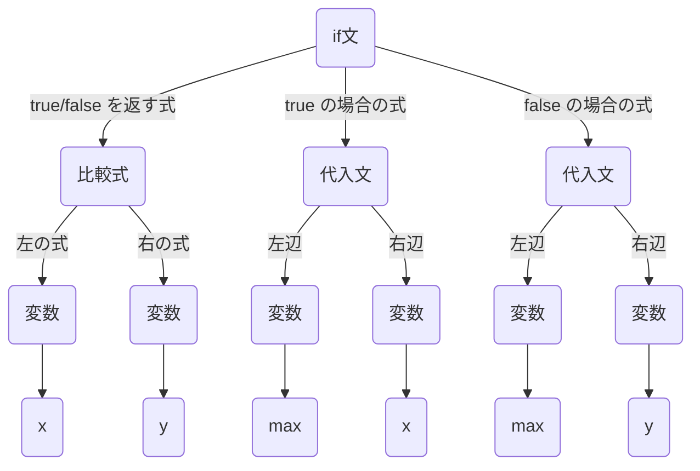

トークン列からこのような構文木を構成するには、文法規則、つまりどのようなトークン列が正しい言語か？を定義する必要があります。文法の定義方法の一つとして、[BNF](https://ja.wikipedia.org/wiki/%E3%83%90%E3%83%83%E3%82%AB%E3%82%B9%E3%83%BB%E3%83%8A%E3%82%A6%E3%82%A2%E8%A8%98%E6%B3%95) (バッカス・ナウア記法, Backus–Naur form) があります。今回実装する正規表現の BNF は以下のような感じです。

```xml
<regexp> ::= <union-expr>
<union-expr> ::= <concat-expr> UNION <union-expr> | <concat-expr>
<concat-expr> ::= <plus-expr> <concat-expr> | <plus-expr>
<plus-expr> ::= <factor-expr> PLUS | <star-expr>
<star-expr> ::= <factor-expr> STAR | <option-expr>
<option-expr> ::= <factor-expr> OPTION | <factor-expr>
<factor-expr> ::= LPAREN <union-expr> RPAREN | DOT | CHAR(x)
```

`::=` で定義されるのが一つの規則で、左辺の記号から右辺の記号列を導くことができます。紛らわしいですが、ここでの `|` は正規表現ではなく BNF の記法で、`|` で分割されたいずれかの記号列を導くことができる、という意味になります。例えば、規則 `<union-expr>` から生成される記号列は以下のいずれかです。

- `<concat-expr>` から生成される記号列 + `UNION` + `<union-expr>` から生成される記号列
- `<concat-expr>` から生成される記号列

規則 `<regexp>` から始めて、規則 (非終端記号) がなくなるまで連続的に規則を適用することで生成されるトークン列 (終端記号列) は、すべて (今回定義する) 正規表現です。

試しに、文字列 `(ab|c)*` に対応する以下のトークン列を `<regexp>` から導いてみましょう！

```
LPAREN CHAR(a) CHAR(b) UNION CHAR(c) RPAREN STAR
```

::: details (ab|c)\* を表すトークン列の導出

1. `<regexp>`: トップレベルの記号
2. `<union-expr>`: 規則 `<regexp>` を適用して `<union-expr>` に変換
3. `<concat-expr>`: 規則 `<union-expr>` の右側を適用
4. `<plus-expr>`: 規則 `<concat-expr>` の右側
5. `<star-expr>`: 規則 `<plus-expr>` の右
6. `<factor-expr> STAR`: `<star-expr>` の左
7. `LPAREN <union-expr> RPAREN STAR`: `<factor-expr>` の 1 番目
8. `LPAREN <concat-expr> UNION <union-expr> RPAREN STAR`: `<union-expr>` の左
9. `LPAREN <plus-expr> <concat-expr> UNION <union-expr> RPAREN STAR`: `<concat-expr>` の左
10. `LPAREN <star-expr> <concat-expr> UNION <union-expr> RPAREN STAR`: `<plus-expr>` の右
11. `LPAREN <option-expr> <concat-expr> UNION <union-expr> RPAREN STAR`: `<star-expr>` の右
12. `LPAREN <factor-expr> <concat-expr> UNION <union-expr> RPAREN STAR`: `<option-expr>` の右
13. `LPAREN CHAR(a) <concat-expr> UNION <union-expr> RPAREN STAR`: `<factor-expr>` の 3 番目
14. `LPAREN CHAR(a) <plus-expr> UNION <union-expr> RPAREN STAR`: `<concat-expr>` の右
15. `LPAREN CHAR(a) <star-expr> UNION <union-expr> RPAREN STAR`: `<plus-expr>` の右
16. `LPAREN CHAR(a) <option-expr> UNION <union-expr> RPAREN STAR`: `<star-expr>` の右
17. `LPAREN CHAR(a) <factor-expr> UNION <union-expr> RPAREN STAR`: `<option-expr>` の右
18. `LPAREN CHAR(a) CHAR(b) UNION <union-expr> RPAREN STAR`: `<factor-expr>` の 3 番目
19. (省略) `<union-expr>` -> `<factor-expr>` までずっと右
20. `LPAREN CHAR(a) CHAR(b) UNION CHAR(c) RPAREN STAR`: `<factor-expr>` の 3 番目
    できました！

:::

このトークン列から生成される AST は以下のようになります。

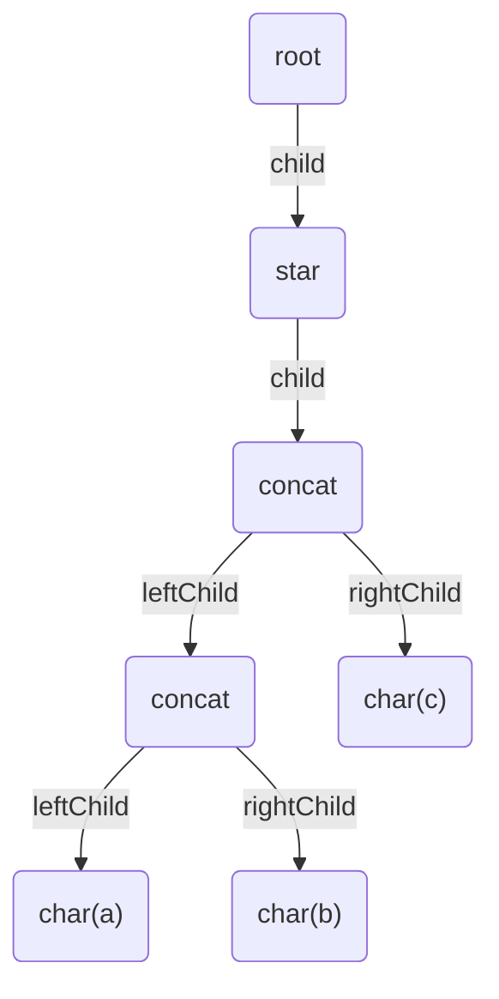

:::message
文法規則に従ってトークン列から抽象構文木を生成するアルゴリズムは [実装編: Parser](#parser) で実装します。
:::

## 有限オートマトン

[オートマトン](https://ja.wikipedia.org/wiki/%E3%82%AA%E3%83%BC%E3%83%88%E3%83%9E%E3%83%88%E3%83%B3) (automaton) とは、ざっくり「状態」と「遷移規則」をもった抽象的な計算モデルです。特に、状態数が有限のものを [有限オートマトン](https://ja.wikipedia.org/wiki/%E6%9C%89%E9%99%90%E3%82%AA%E3%83%BC%E3%83%88%E3%83%9E%E3%83%88%E3%83%B3) (finite automaton) といいます。本来は数学的記号を導入して形式的に定義したほうがよいのですが、具体例を示してしまった方が分かりやすいので、まずは以下の例をみてみましょう。

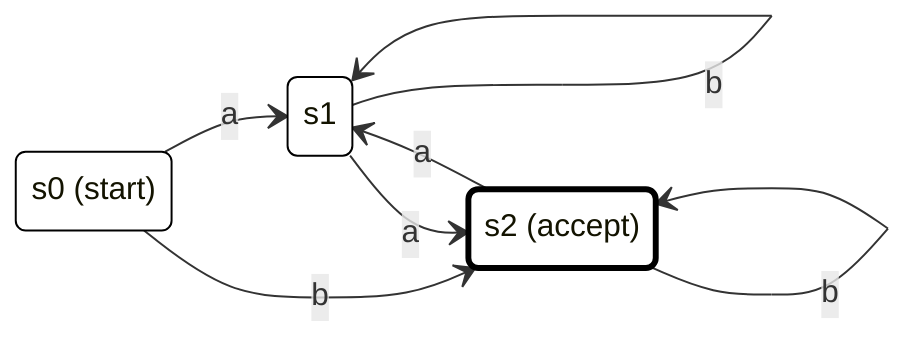

3 つの状態と各状態からの遷移 (文字) からできています。また、特別な状態として初期状態 (start) と受理状態 (accept) があります。ある文字列が与えられたとき、初期状態から始めて文字を 1 文字ずつ読み込みながら状態を遷移していき、すべての文字を読み込んだ時点で受理状態にいたらその文字は受理されます。初期状態は必ず一つ、受理状態は複数あっても構いません。

この有限オートマトンは `a`, `b` からなる文字列が与えられたとき、それが `a` を偶数個含むかどうかを判定することができます。`abab` が与えられたときの判定処理は以下のような感じです。

1. 初期状態 `s0` からスタート
2. 1 文字目が `a` なので、`s0` から `a` で遷移できる状態 `s1` に移動
3. 2 文字目が `b` なので、`s1` から `b` で遷移できる状態 `s1` に移動
4. 3 文字目が `a` なので、`s1` から `a` で遷移できる状態 `s2` に移動
5. 4 文字目が `b` なので、`s2` から `b` で遷移できる状態 `s2` に移動
6. すべての入力文字列を読んだ時点で受理状態 `s2` にいるので、この文字列は受理される

状態を解釈すると、`s1` が「これまでに読んでいる文字列のうち `a` の数が奇数個」、`s2` が 「これまでに読んでいる文字列のうち `a` の数が偶数個」となっています。

このように、有限オートマトンは「ある文字の集合を決めたときにその文字からなる文字列がある性質を満たすかどうか？」を判定することができます。

## 正規表現と有限オートマトンの対応

正規表現は複数パターンの文字列を一つの文字列で表現したもので、ある文字列がそのパターンに一致するか判定したりすることができます。任意の正規表現について、それに対応する有限オートマトンに変換できれば判定処理が実現できそうです。ここでは、各正規表現に対応する有限オートマトンの構成方法について考えます。

### リテラル文字

リテラル文字トークン `CHAR(a)` に対応するオートマトンは以下の通りです。初期状態からはじめて、文字 `a` を受け取ったら受理状態に遷移する。簡単ですね！

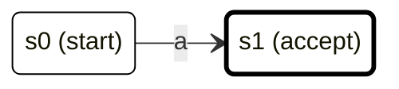

... ところで、`a` 以外の文字列が来たときはどうなるのでしょうか？

遷移先が 0 個 (未定義)であったり、2 個以上だったりするものを [非決定性有限オートマトン](https://ja.wikipedia.org/wiki/%E9%9D%9E%E6%B1%BA%E5%AE%9A%E6%80%A7%E6%9C%89%E9%99%90%E3%82%AA%E3%83%BC%E3%83%88%E3%83%9E%E3%83%88%E3%83%B3) (nondeterministic finite automaton, NFA) といいます。それに対して、入力に対して遷移先が必ず 1 つに定まっているものを [決定性有限オートマトン](https://ja.wikipedia.org/wiki/%E6%B1%BA%E5%AE%9A%E6%80%A7%E6%9C%89%E9%99%90%E3%82%AA%E3%83%BC%E3%83%88%E3%83%9E%E3%83%88%E3%83%B3) (deterministic finite automaton, DFA) といいます。先ほどの `a` が偶数個か判定するやつは (入力文字が `a`, `b` のみという前提のもとで) DFA です。

### 連接

連接は、2 つの正規表現 `expr1`, `expr2` があるとき、それらをその順で並べたもの `expr1expr2` でした。まず前提として、`expr1`, `expr2` それぞれに対応する NFA ができていると仮定します。ここで、初期状態と受理状態以外はどうでもいいので省略しています。

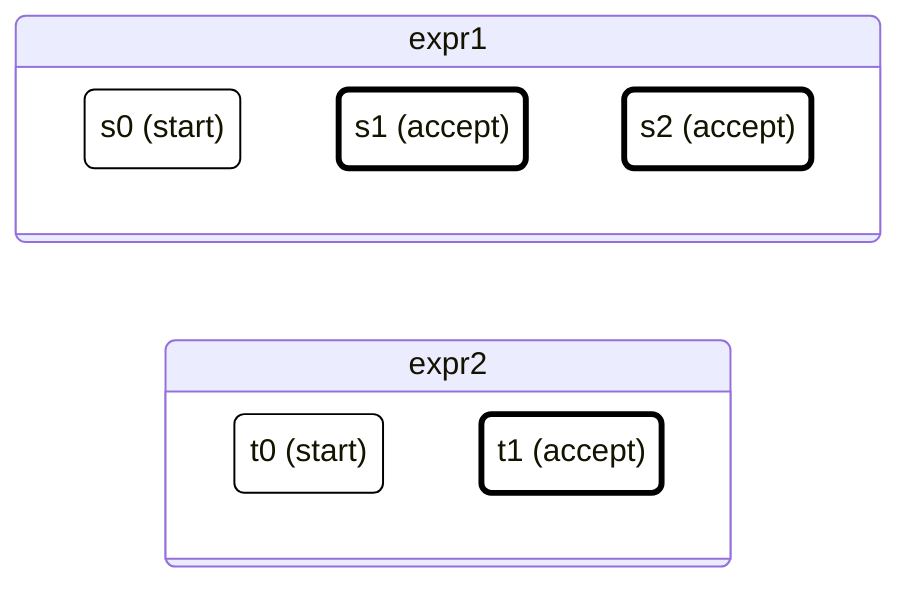

これらを利用して連接に対応する NFA を構成する方法を考えます。そのために、ここで イプシロン遷移 (ε-遷移) というものを導入します。簡単にいうと「ある入力に対して、いくらでも遷移してもいいし、全くしなくてもいい」遷移規則です。例えば、以下のような NFA を考えたとき、 `s0` にいる状態で入力 `a` を受け取ったときは、 `ε` を経て `a` の遷移で `s2` に移動したあと、状態 `s2` に留まることも、 `s3` へ遷移することもできます。よって、 NFA の動作をシミュレートする際は、現在いる複数状態を管理しながら並列実行する必要があります。

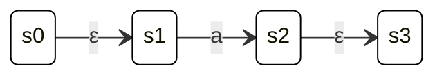

このイプシロン遷移を用いると、先程の連接に対応する NFA は以下のように構成することができます。

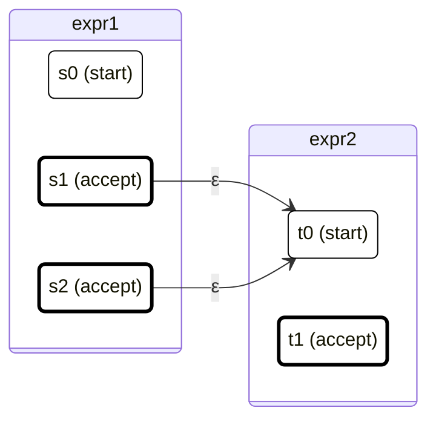

`expr1` のすべての受理状態について、ε-遷移で `expr2` の初期状態に移動できるようにしています。NFA の直列つなぎ的な感じですね。2 つの NFA を合成してできた新たな NFA について、初期状態は `s0`、受理状態は `t1` となります。

これで連接については OK です。以降の正規表現について、対応した NFA を考えるための道具は既にそろっているので、ぜひご自身で変換方法を考えてみてください。

### 論理和

次に、2 つの正規表現 `expr1`, `expr2` の論理和 `expr1|expr2` に対応する NFA を構成する方法を考えます。新たに初期状態 `u0` を用意して、`expr1`, `expr2` それぞれの初期状態へ ε-遷移で移動できるようにします。受理状態は、元の 2 つの NFA のすべての受理状態の集合 (`s1`, `s2`, `t1`) になります。こちらは並列つなぎ的な感じですね。

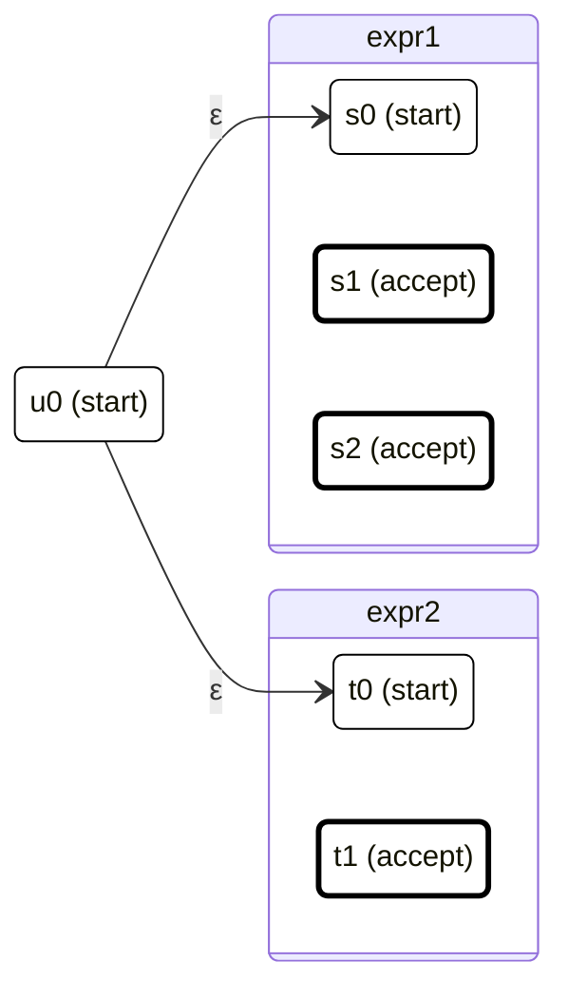

これで論理和に対応する NFA を構成することができました。

### 数量子 `+`

数量詞 `+` は「直前の正規表現の 1 回以上の繰り返し」でした。`expr+` に対応する NFA を考えるために、まず `expr` に対応する NFA ができていると仮定します。

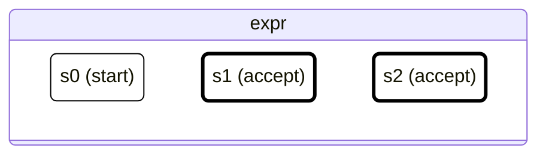

繰り返しに対応するには、すべての受理状態から初期状態への ε-遷移を追加します。これで、受理状態にいる状態からさらに文字列を読む場合に状態を初期状態にリセットすることができます。

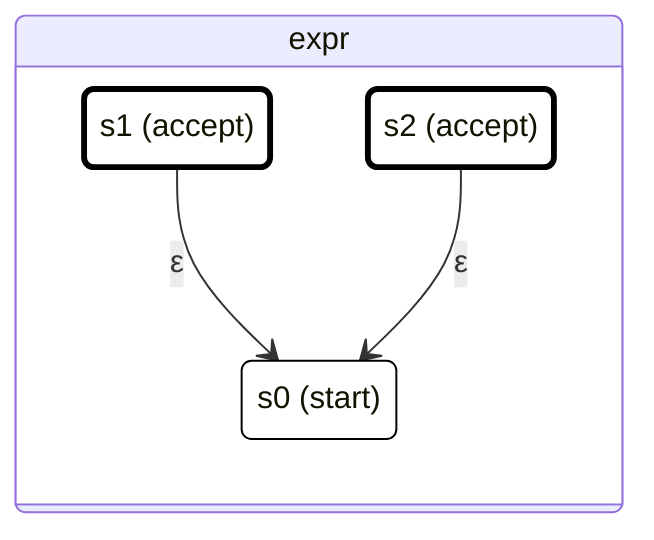

これで `expr+` に対応する NFA を構成することができました。

### 数量子 `*`

数量詞 `*` は「直前の正規表現の 0 回以上の繰り返し」でした。0 回でも OK ということは、初期状態の時点で受理されるので、先ほどの `expr+` に対応する NFA について、初期状態を受理状態に追加するとよさそうです。

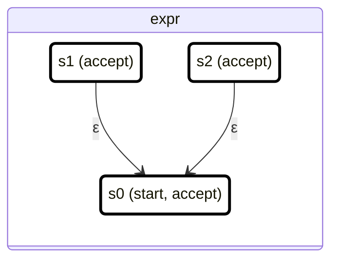

これで `expr*` に対応する NFA を構成することができました。

### 数量子 `?`

数量詞 `?` は「直前の正規表現の 0 または 1 回の出現」でした。`*` と同じ考え方で、`expr` に対応する NFA について初期状態を受理状態に含めるだけで OK ですね。

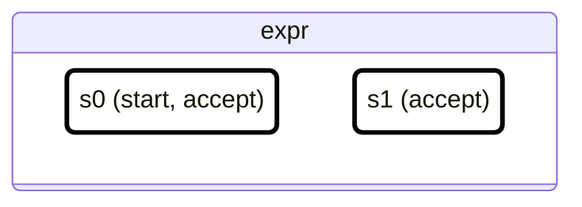

これで `expr?` に対応する NFA を構成することができました。
以上で、正規表現処理系をつくるための理論的側面をざっとおさえることができました。

# 実装編

ここでは、TypeScript の型機能のみを用いた正規表現処理系を実装していきます。

## Lexer

まず、字句解析モジュール `lexer` を実装していきましょう！
はじめに、トークンに関連する型を定義します。

```ts: token.ts
// トークンの基底型
type Token = { type: string };

// 各トークンの型
type TokenLParen = Token & { type: "LPAREN" };
type TokenRParen = Token & { type: "RPAREN" };
type TokenUnion = Token & { type: "UNION" };
type TokenPlus = Token & { type: "PLUS" };
type TokenStar = Token & { type: "STAR" };
type TokenOption = Token & { type: "OPTION" };
type TokenDot = Token & { type: "DOT" };
type TokenChar<C extends string> = Token & { type: "CHAR"; char: C };
type TokenAnchorStart = Token & { type: "ANCHOR_START" };
type TokenAnchorEnd = Token & { type: "ANCHOR_END" };
```

まずトークンの基底型として `string` 型の `type` プロパティを持ったオブジェクト型である `Token` を定義します。次に、`TokenLParen` では `LPAREN` といった具合に、 `type` で特定の文字列を指定することで具体的なトークンを指定します。ただし、リテラル文字に対応する `TokenChar` については、指定された文字を保持しておく必要があるため、型パラメータ `S` をとって `char` プロパティの型とします。

また、利便性のために正規表現文字とトークン型のマッピングを表現した型 `TokenMap` を定義しておきます。

```ts: token.ts
type TokenMap = {
  "(": TokenLParen;
  ")": TokenRParen;
  "|": TokenUnion;
  "+": TokenPlus;
  "*": TokenStar;
  "?": TokenOption;
  ".": TokenDot;
  "^": TokenAnchorStart;
  $: TokenAnchorEnd;
};
```

次に、メインとなる字句解析型 `Lexer` の定義です。

```ts: lexer.ts
// 字句解析型
type Lexer<S extends string> = LexerInternal<S>;

// 字句解析型 (内部型)
type LexerInternal<
  S extends string,
  Tokens extends Token[] = []
> = S extends `${infer Head}${infer Tail}`
  ? Head extends keyof TokenMap
    // TokenMap に存在するときはそのトークンを追加
    ? LexerInternal<Tail, [...Tokens, TokenMap[Head]]>
    : Head extends "\\"
    // エスケープ文字の場合はその文字のリテラル文字トークンを追加
    ? Tail extends `${infer EscapedChar}${infer EscapedTail}`
      ? LexerInternal<EscapedTail, [...Tokens, TokenChar<EscapedChar>]>
      : never
    : Head extends string
    // その他の場合は C のリテラル文字トークンとして解釈
    ? LexerInternal<Tail, [...Tokens, TokenChar<Head>]>
    : never
  : {
      tokens: Tokens;
    };
```

まず `LexerInternal` の型引数について、`S` は正規表現として解釈する文字列、`Tokens` は字句解析結果のトークン列 `Token[]` です。パラメータ `Tokens` はあくまでも `LexerInternal` の再帰処理のためのものなので、ラップした型 `Lexer` を定義し、外側からはこちらを使ってもらうようにします。

`LexerInternal` では、[Template Literal Types](https://www.typescriptlang.org/docs/handbook/2/template-literal-types.html) によって `S` の文字列を先頭から読み込んでいき、例えば `(` に一致したときは、「残りの文字列 `Tail`」と「`TokenLParen` を追加したトークン列」を入力とする `LexerInternal` を返します。このように、再帰的に次に続く文字列を処理しながらトークン列 `Tokens` を生成します。各正規表現記号にマッチするかどうかを書き連ねる代わりにここで `TokenMap` を用いています。

`S` の先頭 `Head` がエスケープ `\` に一致する場合はその次の文字を `EscapedChar` としてリテラル文字トークン `TokenChar<EscapedChar>` を追加します。以上のどれにも当てはまらない場合は、先頭文字 `Head` に対応する文字列トークン `TokenChar<Head>` を追加します。

これで、字句解析型 `Lexer` ができました！
以下のように、正規表現文字列を与えると、それに対応するトークン列に変換されます。

```ts
type Result = Lexer<"(a|b)+">;
// [TokenLParen, TokenChar<"a">, TokenUnion, TokenChar<"b">, TokenRParen, TokenPlus]
```

## Parser

次に、トークン列から抽象構文木を構成する構文解析型 `Parser` を作成します。
まず、抽象構文木を表す型を用意していきます。

### ASTNode

```ts: ast.ts
// 抽象構文木のノード基底型
type ASTNode = { id: string; type: string };
```

抽象構文木のノード基底型 `ASTNode` は、ノード固有の識別子 `id` とノードの種類 `type` を持つオブジェクト型とし、それぞれ `string` 型とします。

### ASTNodeRoot

具体的なノードについて、まずは構文木の根ノードとなる `ASTNodeRoot` 型を作ります。

```ts: ast.ts
// 根ノード型
type ASTNodeRootId = "#";
type ASTNodeRoot<Child extends ASTNode = ASTNode> = ASTNode & {
  id: ASTNodeRootId;
  type: "ROOT";
  child: Child;
};
```

パラメータ `Child` は子となるノード `ASTNode` です。`id` はなんでもいいのですが、ここでは文字 `#` としています。

### ASTNodeUnion

次に、論理和 `|` ノード型 `ASTNodeUnion` の定義です。

```ts: ast.ts
// 論理和ノード型
type ASTNodeUnionId<ParentId extends ASTNode["id"]> = `${ParentId}u`;
type ASTNodeUnionIdL<ParentId extends ASTNode["id"]> = `${ParentId}u-l`;
type ASTNodeUnionIdR<ParentId extends ASTNode["id"]> = `${ParentId}u-r`;
type ASTNodeUnion<
  ParentId extends ASTNode["id"] = ASTNode["id"],
  LChild extends ASTNode = ASTNode,
  RChild extends ASTNode = ASTNode
> = ASTNode & {
  id: ASTNodeUnionId<ParentId>;
  type: "UNION";
  left: LChild;
  right: RChild;
};
```

各パラメータについて、`ParentId` は親ノードの識別子、`LChild` は右の子ノード、`RChild` は左の子ノードです。`ASTNodeUnion` の識別子 `ASTNodeUnionId` は、親ノードの識別子 `ParentId` に `u` を付けたものとします。また、左右の子ノードが同じ `type` を持つ場合にそれらを区別するために、子ノードから見た親ノードの左右での識別子 `ASTNodeUnionIdL/R` を別で定義しておきます。

### ASTNodeConcat

```ts: ast.ts
// 連接ノード型
type ASTNodeConcatId<ParentId extends ASTNode["id"]> = `${ParentId}c`;
type ASTNodeConcatIdL<ParentId extends ASTNode["id"]> = `${ParentId}c-l`;
type ASTNodeConcatIdR<ParentId extends ASTNode["id"]> = `${ParentId}c-r`;
type ASTNodeConcat<
  ParentId extends ASTNode["id"] = ASTNode["id"],
  LChild extends ASTNode = ASTNode,
  RChild extends ASTNode = ASTNode
> = ASTNode & {
  id: ASTNodeConcatId<ParentId>;
  type: "CONCAT";
  left: LChild;
  right: RChild;
};
```

連接に対応するノードの型です。論理和のものとほぼ同じです。

### ASTNodePlus

```ts: ast.ts
// 数量子 + ノード型
type ASTNodePlusId<ParentId extends ASTNode["id"]> = `${ParentId}p`;
type ASTNodePlus<
  ParentId extends ASTNode["id"] = ASTNode["id"],
  Child extends ASTNode = ASTNode
> = ASTNode & {
  id: ASTNodePlusId<ParentId>;
  type: "PLUS";
  child: Child;
};
```

数量詞 `+` に対応するノードの型です。識別子は親ノードの識別子に `p` を付け加えたもので、パラメータとして親ノードの識別子 `ParentId` と子ノードの型 `Child` を取ってプロパティ `child` を付け加えます。ここで、`Child` は `+` の対象となる正規表現に対応するノードを想定しています。

### ASTNodeStar

```ts: ast.ts
// 数量子 * ノード型
type ASTNodeStarId<ParentId extends ASTNode["id"]> = `${ParentId}s`;
type ASTNodeStar<
  ParentId extends ASTNode["id"] = ASTNode["id"],
  Child extends ASTNode = ASTNode
> = ASTNode & {
  id: ASTNodeStarId<ParentId>;
  type: "STAR";
  child: Child;
};
```

数量詞 `*` に対応するノードの型です。数量詞 `+` のものとほぼ同じです。

### ASTNodeOption

```ts: ast.ts
// 数量子 ? ノード型
type ASTNodeOptionId<ParentId extends ASTNode["id"]> = `${ParentId}o`;
type ASTNodeOption<
  ParentId extends ASTNode["id"] = ASTNode["id"],
  Child extends ASTNode = ASTNode
> = ASTNode & {
  id: ASTNodeOptionId<ParentId>;
  type: "OPTION";
  child: Child;
};
```

数量詞 `?` に対応するノードの型です。こちらも、数量詞 `+` のものとほぼ同じです。

### ASTNodeDot

```ts: ast.ts
// ワイルドカードノード型
type ASTNodeDotId<ParentId extends ASTNode["id"]> = `${ParentId}d`;
type ASTNodeDot<ParentId extends ASTNode["id"] = ASTNode["id"]> = ASTNode & {
  id: ASTNodeDotId<ParentId>;
  type: "DOT";
};
```

ワイルドカード `.` に対応するノードの型です。任意の 1 文字を表すので子要素はありません。

### ASTNodeChar

```ts: ast.ts
// リテラル文字ノード型
type ASTNodeCharId<
  ParentId extends ASTNode["id"],
  Char extends string
> = `${ParentId}c-${Char}-`;
type ASTNodeChar<
  ParentId extends ASTNode["id"] = ASTNode["id"],
  Char extends string = string
> = ASTNode & {
  id: ASTNodeCharId<ParentId, Char>;
  type: "CHAR";
  char: Char;
};
```

リテラル文字に対応するノードの型です。正規表現のリテラル文字に相当する文字列リテラル型 `Char` を型パラメータに取って、`Char` 型のプロパティ `char` を付け加えます。識別子は親ノードの識別子に `c-${C}-` を付け加えたものとします。

### ASTNodeError

```ts: ast.ts
// エラーノード型
type ASTNodeParseError = ASTNode & {
  id: "#error";
  type: "ERROR";
};
```

構文解析時にうまくパースできなかった場合のノードの型です。
抽象構文木に関する型の定義は以上です。

### Parser

次に、抽象構文木を構築する構文解析型 `Parser` をつくっていきます。ここでは、今回実装する正規表現の BNF が核となるので再掲しておきます。

```xml
<regexp> ::= <union-expr>
<union-expr> ::= <concat-expr> UNION <union-expr> | <concat-expr>
<concat-expr> ::= <plus-expr> <concat-expr> | <plus-expr>
<plus-expr> ::= <factor-expr> PLUS | <star-expr>
<star-expr> ::= <factor-expr> STAR | <option-expr>
<option-expr> ::= <factor-expr> OPTION | <factor-expr>
<factor-expr> ::= LPAREN <union-expr> RPAREN | DOT | CHAR(x)
```

### ParseUnionExpr

まず、規則 `<union-expr>` に基づいてパースを行う `ParseUnionExpr` 型を定義します。

```ts parser.ts
// <union-expr> ::= <concat-expr> UNION <union-expr> | <concat-expr>
type ParseUnionExpr<
  ParentId extends string,
  Tokens extends Token[],
  LeftTokens extends Token[] = []
> = Tokens extends [infer Head extends Token, ...infer Tail extends Token[]]
  ? [
      ParseConcatExpr<ASTNodeUnionIdL<ParentId>, LeftTokens>,
      Head,
      ParseUnionExpr<ASTNodeUnionIdR<ParentId>, Tail>
    ] extends [
      infer ParseConcatExprResult extends ASTNode,
      TokenUnion,
      infer ParseUnionExprResult extends ASTNode
    ]
    ? [ParseConcatExprResult, ParseUnionExprResult] extends
        | [ASTNodeParseError, unknown]
        | [unknown, ASTNodeParseError]
      ? ParseUnionExpr<ParentId, Tail, [...LeftTokens, Head]>
      : ASTNodeUnion<ParentId, ParseConcatExprResult, ParseUnionExprResult>
    : ParseUnionExpr<ParentId, Tail, [...LeftTokens, Head]>
  : ParseConcatExpr<ParentId, LeftTokens>;
```

`Tokens` のトークンを先頭から順に見ていき、現在注目しているトークン `Head` について、`Head` が `TokenUnion` の場合に、 `Head` よりも左のトークン列 `LeftTokens` を `ConcatExpr` としてパース、`Head` よりも右のトークン列 `Tail` を `UnionExpr` としてパースします。パースに成功した (どちらもエラーノード `ASTNodeParseError` でない) 場合は、ノード `ASTNodeUnion` をつくって返します。パースに失敗した場合は、次のトークンに注目した状態の `ParseUnionExpr` を返します。

最後のトークンまで読み込んだ状態 (`Tokens` がすべて `LeftTokens` に移った状態) になったときは `<concat-expr> UNION <union-expr>` でパースできなかったということなので、`<concat-expr>` として解釈してパースするために `ParseConcatExpr` を返します。

### ParseConcatExpr

規則 `<concat-expr>` に基づいてパースを行う `ParseConcatExpr` 型を定義します。先ほどの `ParseUnionExpr` では、着目するトークンを進めながら `<concat-expr> UNION <union-expr>` が適用できるかどうか確認していましたが、ここでは `<plus-expr> <concat-expr>` が適用できるかどうかを確認しています。

```ts parser.ts
// <concat-expr> ::= <plus-expr> <concat-expr> | <plus-expr>
type ParseConcatExpr<
  ParentId extends string,
  Tokens extends Token[],
  LeftTokens extends Token[] = []
> = Tokens extends [infer Head extends Token, ...infer Tail extends Token[]]
  ? [
      ParsePlusExpr<ASTNodeConcatIdL<ParentId>, [...LeftTokens, Head]>,
      ParseConcatExpr<ASTNodeConcatIdR<ParentId>, Tail>
    ] extends [
      infer ParsePlusExprResult extends ASTNode,
      infer ParseConcatExprResult extends ASTNode
    ]
    ? [ParsePlusExprResult, ParseConcatExprResult] extends
        | [ASTNodeParseError, unknown]
        | [unknown, ASTNodeParseError]
      ? ParseConcatExpr<ParentId, Tail, [...LeftTokens, Head]>
      : ASTNodeConcat<ParentId, ParsePlusExprResult, ParseConcatExprResult>
    : ParseConcatExpr<ParentId, Tail, [...LeftTokens, Head]>
  : ParsePlusExpr<ParentId, LeftTokens>;
```

`ParseUnionExpr` とほぼ同じです。

### ParsePlusExpr

規則 `<plus-expr>` に基づいてパースを行う `ParsePlusExpr` 型を定義します。

```ts parser.ts
// <plus-expr> ::= <factor-expr> PLUS | <star-expr>
type ParsePlusExpr<
  ParentId extends string,
  Tokens extends Token[]
> = Tokens extends [...infer FactorTokens extends Token[], TokenPlus]
  ? ParseFactorExpr<
      ASTNodePlusId<ParentId>,
      FactorTokens
    > extends infer ParseFactorExprResult extends ASTNode
    ? ParseFactorExprResult extends ASTNodeParseError
      ? ParseStarExpr<ParentId, Tokens>
      : ASTNodePlus<ParentId, ParseFactorExprResult>
    : ParseStarExpr<ParentId, Tokens>
  : ParseStarExpr<ParentId, Tokens>;
```

受け取ったトークン列 `Tokens` の末尾のトークンが `TokenPlus` の場合は、規則 `<plus-expr>` の左側 `<factor-expr> PLUS` を適用可能なので、末尾以外のトークン列 `FactorTokens` を `ParseFactorExpr` (後述) でパースします。パースに成功した場合は、ノード `ASTNodePlus` をつくってかえします。パースに失敗した場合は、規則 `<star-expr>` を適用するために `ParseStarExpr` (後述) を返します。

### ParseStarExpr

```ts parser.ts
// <star-expr> ::= <factor-expr> STAR | <option-expr>
type ParseStarExpr<
  ParentId extends string,
  Tokens extends Token[]
> = Tokens extends [...infer FactorTokens extends Token[], TokenStar]
  ? ParseFactorExpr<
      ASTNodeStarId<ParentId>,
      FactorTokens
    > extends infer ParseFactorExprResult extends ASTNode
    ? ParseFactorExprResult extends ASTNodeParseError
      ? ParseOptionExpr<ParentId, Tokens>
      : ASTNodeStar<ParentId, ParseFactorExprResult>
    : ParseOptionExpr<ParentId, Tokens>
  : ParseOptionExpr<ParentId, Tokens>;
```

規則 `<star-expr>` に基づいてパースを行う `ParseStarExpr` 型を定義します。`ParsePlusExpr` とほぼ同じなので、説明は省きます。

### ParseOptionExpr

```ts parser.ts
// <option-expr> ::= <factor-expr> OPTION | <factor-expr>
type ParseOptionExpr<
  ParentId extends string,
  Tokens extends Token[]
> = Tokens extends [...infer FactorTokens extends Token[], TokenOption]
  ? ParseFactorExpr<
      ASTNodeOptionId<ParentId>,
      FactorTokens
    > extends infer ParseFactorExprResult extends ASTNode
    ? ParseFactorExprResult extends ASTNodeParseError
      ? ParseFactorExpr<ParentId, Tokens>
      : ASTNodeOption<ParentId, ParseFactorExprResult>
    : ParseFactorExpr<ParentId, Tokens>
  : ParseFactorExpr<ParentId, Tokens>;
```

規則 `<option-expr>` に基づいてパースを行う `ParseOptionExpr` 型を作成します。こちらも `ParsePlusExpr` とほぼ同じなので、説明は省きます。

### ParseFactorExpr

```ts parser.ts
// <factor-expr> ::= LPAREN <union-expr> RPAREN | DOT | CHAR(x)
type ParseFactorExpr<
  ParentId extends string,
  Tokens extends Token[]
> = Tokens extends [
  TokenLParen,
  ...infer UnionTokens extends Token[],
  TokenRParen
]
  ? UnionTokens extends []
    ? ASTNodeChar<ParentId, "">
    : ParseUnionExpr<ParentId, UnionTokens>
  : Tokens extends [TokenDot]
  ? ASTNodeDot<ParentId>
  : Tokens extends [TokenChar<infer Char extends string>]
  ? ASTNodeChar<ParentId, Char>
  : ASTNodeParseError;
```

規則 `<factor-expr>` に基づいてパースを行う `ParseFactorExpr` 型を定義します。

まず、与えられたトークン列が `(UnionExpr)` に合致するか確認します。トークン列の先頭が `(`, 末尾が `)` となっている場合は、その間のトークン列 `UnionTokens` を `ParseUnionExpr` に渡し、規則 `<union-expr>` に基づいたパース処理を委ねます。

`(UnionExpr)` に合致しない場合は、トークン列が `Dot` に合致するか確認します。合致する場合は、ワイルドカード `.` に対応するノード `ASTNodeDot` を返します。

`Dot` に合致しない場合は、`Char` に合致するかどうか確認します。合致する場合は、リテラル文字ノード `ASTNodeChar<ParentId, Char>` を返します。

以上のいずれにも合致しない場合は、エラー状態を表すノード `ASTNodeParseError` を返します。

### Parser

最後に構文解析型 Parser を作成します。

```ts: parser.ts
// 構文解析型
type Parser<Tokens extends Token[]> =
  ParseOption<Tokens> extends infer ParseOptionResult extends {
    tokens: Token[];
    option: TRegExpOption;
  }
    ? {
        ast: ASTNodeRoot<
          ParseUnionExpr<ASTNodeRootId, ParseOptionResult["tokens"]>
        >;
        option: ParseOptionResult["option"];
      }
    : never;

type ParseOption<
  Tokens extends Token[],
  Option extends TRegExpOption = {}
> = Tokens extends [TokenAnchorStart, ...infer Rest extends Token[]]
  ? ParseOption<Rest, Option & { anchorStart: true }>
  : Tokens extends [...infer Rest extends Token[], TokenAnchorEnd]
  ? ParseOption<Rest, Option & { anchorEnd: true }>
  : {
      tokens: Tokens;
      option: Option;
    };
```

今回の実装ではアンカー (`^`,`$`) をオプションとして扱い、構文木とは分離させます。具体的な処理の説明は省きますが、まず `Parser` のパラメータとして与えられたトークン列を `ParseOption` でパースし、残りのトークン列を `ParseUnionExpr` でパースします。そして、その結果を子ノードとしてもつ `ASTNodeRoot` とオプションをもったオブジェクト型を返します。

```ts: tregexp.ts
type TRegExpOption = {
  readonly anchorStart?: boolean; // ^
  readonly anchorEnd?: boolean; // $
};
```

以上で、構文解析型 `Parser` をつくることができました！
与えられたトークン列に対して、規則に基づいた構文木が生成されます。

## NFA

ここでは、与えられた抽象構文木からその正規表現を受理する NFA を構成する処理を型レベルで実装します。まずは、NFA そのものの型を定義しましょう。

```ts nfa.ts
// NFA の状態
type NFAState = string;
// イプシロン遷移
type EpsChar = null;

// NFA の遷移
type NFATransition = {
  from: NFAState;
  to: NFAState;
  char: string | EpsChar;
};

// NFA 型
type NFA = {
  states: NFAState[];
  transitions: NFATransition[];
  start: NFAState;
  accept: NFAState[];
};
```

型定義の通り、有限オートマトンの定義は (文字集合)、状態集合、遷移規則集合、初期状態、受理状態集合からなります。

## NFABuilder

次に、NFA を構築する型 `NFABuilder` を定義します。構築方法は [正規表現と有限オートマトンの対応](#正規表現と有限オートマトンの対応) で紹介されているものに基づいています。

### NFABuilder, NFABuilderInternal

まずはトップレベルの `NFABuilder` の定義からです。

```ts: nfa-builder.ts
// 抽象構文木から NFA を構築する型
type NFABuilder<Node extends ASTNodeRoot> = {
  nfa: NFABuilderInternal<Node>;
};

// 抽象構文木から NFA を構築する型 (内部型)
type NFABuilderInternal<Node extends ASTNode> = Node extends ASTNodeRoot
  ? NFABuilderInternal<Node["child"]>
  : Node extends ASTNodeUnion
  ? NFABuilderUnion<Node>
  : Node extends ASTNodeConcat
  ? NFABuilderConcat<Node>
  : Node extends ASTNodePlus
  ? NFABuilderPlus<Node>
  : Node extends ASTNodeStar
  ? NFABuilderStar<Node>
  : Node extends ASTNodeOption
  ? NFABuilderOption<Node>
  : Node extends ASTNodeDot
  ? NFABuilderDot<Node>
  : Node extends ASTNodeChar
  ? NFABuilderChar<Node>
  : never;
```

パラメータとして与えられた抽象構文木 `ASTNodeRoot` から `NFA` を返します。`NFABuilderInternal` では AST のノードの種別に応じて別々の Builder を返します。

### NFABuilderUnion

```ts: nfa-builder.ts
// 論理和ノード型に対応する NFA を構築する型
type NFABuilderUnion<
  Node extends ASTNodeUnion,
  LNFA extends NFA = NFABuilderInternal<Node["left"]>,
  RNFA extends NFA = NFABuilderInternal<Node["right"]>
> = {
  states: [...LNFA["states"], ...RNFA["states"], `${Node["id"]}@0`];
  transitions: [
    ...LNFA["transitions"],
    ...RNFA["transitions"],
    { from: `${Node["id"]}@0`; to: LNFA["start"]; char: EpsChar },
    { from: `${Node["id"]}@0`; to: RNFA["start"]; char: EpsChar }
  ];
  start: `${Node["id"]}@0`;
  accept: [...LNFA["accept"], ...RNFA["accept"]];
};
```

まず、`NFABuilderInternal` 側から与えられた `ASTNodeUnion` を `Node` として、左右のノード `Node["left"]`, `Node["right"]` について再帰的に `NFABuilderInternal` を適用して `NFA` を構築したものをそれぞれ `LNFA`, `RNFA` とします。これで、前に述べた構築方法の前提ができました。

2 つの `NFA` があったときそれらの論理和 NFA を構成するには、新たに初期状態を用意して、そこから各 NFA の初期状態への ε-遷移をつくるとよいのでした。よって、以下のような NFA をつくるとよさそうです。

- states: `LNFA`,`RNFA` の全ての状態 + 新しい状態 `${Node["id"]}@0` を状態集合とする。状態の識別子はなんでもよいが、論理和ノードの識別子 + `@0` とする。
- transitions: `LNFA`,`RNFA` の全ての遷移 + 状態`${Node["id"]}@0` から `LNFA`, `RNFA`の初期状態への ε-遷移を遷移集合とする。
- start: `${Node["id"]}@0` を初期状態とする。
- accept: `LNFA`,`RNFA` の全ての受理状態を受理状態集合とする。

### NFABuilderConcat

```ts: nfa-builder.ts
// 連接ノード型に対応する NFA を構築する型
type NFABuilderConcat<
  Node extends ASTNodeConcat,
  LNFA extends NFA = NFABuilderInternal<Node["left"]>,
  RNFA extends NFA = NFABuilderInternal<Node["right"]>
> = {
  states: [...LNFA["states"], ...RNFA["states"]];
  transitions: [
    ...LNFA["transitions"],
    ...RNFA["transitions"],
    ...TransitionsFromStates<LNFA["accept"], RNFA["start"], EpsChar>
  ];
  start: LNFA["start"];
  accept: RNFA["accept"];
};
```

基本的はつくりは `NFABuilderUnion` と同じです。以下の NFA をつくっています。

- states: `LNFA`,`RNFA` の全ての状態
- transitions:`LNFA`,`RNFA` の全ての遷移 + `LNFA` の全ての受理状態から `RNFA` の初期状態への ε-遷移
- start: `LNFA` の初期状態
- accept: `RNFA` の全ての受理状態

ここで、`TransitionsFromStates` 型は複数の集合 `FromStates` と単一の集合 `ToState`、ある文字列 `Char` をパラメータとして、`FromStates` の各状態から `ToState` への文字 `Char` による遷移の集合を返します。

```ts: nfa-builder.ts
type TransitionsFromStates<
  FromStates extends NFAState[],
  ToState extends NFAState,
  Char extends NFATransition["char"]
> = {
  [Index in keyof FromStates]: {
    from: FromStates[Index];
    to: ToState;
    char: Char;
  };
};
```

### NFABuilderPlus

```ts: nfa-builder.ts
// 数量子 + ノード型に対応する NFA を構築する型
type NFABuilderPlus<
  Node extends ASTNodePlus,
  CNFA extends NFA = NFABuilderInternal<Node["child"]>
> = {
  states: CNFA["states"];
  transitions: [
    ...CNFA["transitions"],
    ...TransitionsFromStates<CNFA["accept"], CNFA["start"], EpsChar>
  ];
  start: CNFA["start"];
  accept: CNFA["accept"];
};
```

まず、`NFABuilderInternal` 側から与えられた `ASTNodeUnion` を `Node` として、`Node` の子要素 (`expr+` の `expr` に対応するノード) に対して `NFABuilderInternal` を適用して得られた `NFA` を `CNFA` とします。

続いて、以下のような NFA を返します。

- states: `CNFA` の全ての状態
- transitions:`CNFA` の全ての遷移 + `CNFA` の全ての受理状態から `CNFA` の初期状態への ε-遷移
- start: `CNFA` の初期状態
- accept: `CNFA` の全ての受理状態

### NFABuilderStar

```ts: nfa-builder.ts
// 数量子 * ノード型に対応する NFA を構築する型
type NFABuilderStar<
  Node extends ASTNodeStar,
  CNFA extends NFA = NFABuilderInternal<Node["child"]>
> = {
  states: CNFA["states"];
  transitions: [
    ...CNFA["transitions"],
    ...TransitionsFromStates<CNFA["accept"], CNFA["start"], EpsChar>
  ];
  start: CNFA["start"];
  accept: [...CNFA["accept"], CNFA["start"]];
};
```

`NFABuilderPlus` とほぼ同じです。以下の NFA を返します。

- states: `CNFA` の全ての状態
- transitions:`CNFA` の全ての遷移 + `CNFA` の全ての受理状態から `CNFA` の初期状態への ε-遷移
- start: `CNFA` の初期状態
- accept: `CNFA` の全ての受理状態 + `CNFA` の初期状態

### NFABuilderOption

```ts: nfa-builder.ts
// 数量子 ? ノード型に対応する NFA を構築する型
type NFABuilderOption<
  Node extends ASTNodeOption,
  CNFA extends NFA = NFABuilderInternal<Node["child"]>
> = {
  states: CNFA["states"];
  transitions: CNFA["transitions"];
  start: CNFA["start"];
  accept: [...CNFA["accept"], CNFA["start"]];
};
```

こちらも `NFABuilderPlus` と同じつくりです。以下の NFA を返します。

- states: `CNFA` の全ての状態
- transitions:`CNFA` の全ての遷移
- start: `CNFA` の初期状態
- accept: `CNFA` の全ての受理状態 + `CNFA` の初期状態

### NFABuilderDot

```ts: nfa-builder.ts
// ワイルドカードノード型に対応する NFA を構築する型
type NFABuilderDot<Node extends ASTNodeDot> = {
  states: [`${Node["id"]}@0`, `${Node["id"]}@1`];
  transitions: [
    {
      from: `${Node["id"]}@0`;
      to: `${Node["id"]}@1`;
      char: string;
    }
  ];
  start: `${Node["id"]}@0`;
  accept: [`${Node["id"]}@1`];
};
```

ワイルドカードノード型に対応する NFA を構築する型です。与えられたワイルドカードノードの識別子をもとに新たな状態を 2 つ (`@0`, `@1`) つくり、以下の NFA を返します。

- states: `@0`, `@1`
- transitions: `@0` から `@1` への任意の文字 (`string`) による遷移
- start: `@0`
- accept: `@1`

### NFABuilderChar

```ts: nfa-builder.ts
// リテラル文字ノード型に対応する NFA を構築する型
type NFABuilderChar<Node extends ASTNodeChar> = {
  states: [`${Node["id"]}@0`, `${Node["id"]}@1`];
  transitions: [
    {
      from: `${Node["id"]}@0`;
      to: `${Node["id"]}@1`;
      char: Node["char"];
    }
  ];
  start: `${Node["id"]}@0`;
  accept: [`${Node["id"]}@1`];
};
```

リテラル文字ノード型に対応する NFA を構築する型です。与えられたリテラル文字ノードの識別子をもとに新たな状態を 2 つ (`@0`, `@1`) つくり、以下の NFA を返します。

- states: `@0`, `@1`
- transitions: `@0` から `@1` への `ASTNodeChar` で指定された文字 (`Node["char"]`) による遷移
- start: `@0`
- accept: `@1`

以上で、NFA の構築に関する型の定義が完了しました！

## NFAExec

次に、入力文字列をもとに NFA の動作をシミュレートする型 `NFAExec` を定義していきます。

### NextStatesFromSingleState

まずは、遷移集合 `Transitions` に基づいて、ある状態 `FromState` から文字 `Char` で遷移できる状態を列挙する型 `NextStatesFromSingleState` をつくります。

```ts: nfa-exec.ts
// 遷移集合 Transitions に基づいて、
// ある状態 FromState から文字 Char で遷移できる状態を列挙する型
type NextStatesFromSingleState<
  FromState extends NFAState,
  Char extends string | EpsChar,
  Transitions extends NFATransition[]
> = NextStatesFromSingleStateInternal<FromState, Char, Transitions>;

// 内部型
type NextStatesFromSingleStateInternal<
  FromState extends NFAState,
  Char extends string | EpsChar,
  Transitions extends NFATransition[],
  Result extends NFAState[] = []
> = Transitions extends [
  infer Head extends NFATransition,
  ...infer Tail extends NFATransition[]
]
  ? [FromState, Char] extends [Head["from"], Head["char"]]
    ? NextStatesFromSingleStateInternal<
        FromState,
        Char,
        Tail,
        [...Result, Head["to"]]
      >
    : NextStatesFromSingleStateInternal<FromState, Char, Tail, Result>
  : Unique<Result>;
```

`NextStatesFromSingleStateInternal` は前述の 3 つのパラメータと、遷移可能な状態集合 `Result` をパラメータとし、最終的な `Result` を返します。

まず、`Transitions` を展開し、先頭の遷移 `Head` に着目します。指定された `FromState` が `Head` の遷移元状態 `Head["from"]` かつ、指定された `Char` が `Head` の遷移文字 `Head["char"]` である場合は遷移が可能なので `Head` の遷移先状態 `Head["to"]` を `Result` に含めて再帰的に処理した `NextStatesFromSingleStateInternal` を返します。

`Transitions` の全ての遷移のチェックが終わったら `Result` について `Unique` を適用したものを返します。ここで `Unique` は以下のように、ある配列型から重複要素を取り除いた配列型を返します。例えば `Unique<[1, 2, 3, 2]>` は `[1, 2, 3]` となります。

```ts: unique.ts
// 配列型の重複要素を取り除く型
type Unique<T extends unknown[]> = UniqueInternal<T>;

type UniqueInternal<
  T extends unknown[],
  Result extends unknown[] = []
> = T extends [infer Head, ...infer Tail]
  ? Head extends Result[number]
    ? UniqueInternal<Tail, Result>
    : UniqueInternal<Tail, [...Result, Head]>
  : Result;
```

### NextStatesFromStates

つぎに、遷移集合 `Transitions` に基づいて、ある状態集合 `FromStates` から文字 `Char` で遷移できる状態を列挙する型 `NextStatesFromStates` をつくります。先ほどの `NextStatesFromSingleState` の遷移元が複数のバージョンです。

```ts: nfa-exec.ts
type NextStatesFromStates<
  FromStates extends NFAState[],
  Char extends string | EpsChar,
  Transitions extends NFATransition[]
> = NextStatesFromStatesInternal<FromStates, Char, Transitions>;

type NextStatesFromStatesInternal<
  FromStates extends NFAState[],
  Char extends string | EpsChar,
  Transitions extends NFATransition[],
  Result extends NFAState[] = []
> = FromStates extends [
  infer Head extends NFAState,
  ...infer Tail extends NFAState[]
]
  ? NextStatesFromSingleState<
      Head,
      Char,
      Transitions
    > extends infer NextStates extends NFAState[]
    ? NextStatesFromStatesInternal<
        Tail,
        Char,
        Transitions,
        [...Result, ...NextStates]
      >
    : NextStatesFromStatesInternal<Tail, Char, Transitions, Result>
  : Unique<Result>;
```

`FromStates` の先頭要素状態 `Head` を遷移元として `NextStatesFromSingleState` を適用し、遷移可能な状態集合があれば `Result` に追加して残りの遷移元集合 `Tail` について再帰的に処理します。全ての `FromStates` について処理が完了したら `Unique<Result>` を返します。

### EpsilonClosure

ここで、新たな用語「イプシロン閉包 (ε-閉包)」を導入します。ε-閉包とは、ある状態から ε-遷移のみで遷移可能な状態の集合のことをいいます。ある状態集合 `FromStates` の ε-閉包を返す型 `EpsilonClosure` を定義します。

```ts: nfa-exec.ts
// ある状態集合の ε-閉包を返す型
type EpsilonClosure<
  FromStates extends NFAState[],
  Transitions extends NFATransition[]
> = EpsilonClosureInternal<FromStates, Transitions>;

type EpsilonClosureInternal<
  FromStates extends NFAState[],
  Transitions extends NFATransition[],
  Result extends NFAState[] = FromStates
> = FromStates extends [
  infer Head extends NFAState,
  ...infer Tail extends NFAState[]
]
  ? NextStatesFromSingleState<
      Head,
      EpsChar,
      Transitions
    > extends infer ReachableStates extends NFAState[]
    ? EpsilonClosureInternal<
        [...Tail, ...Diff<ReachableStates, Result>],
        Transitions,
        [...Result, ...ReachableStates]
      >
    : EpsilonClosureInternal<Tail, Transitions, Result>
  : Unique<Result>;
```

`FromStates` の先頭要素 `Head` を遷移元として一度の ε-遷移で到達可能な状態集合を `NextStatesFromSingleState` で取得します。この結果を `ReachableStates` とします。`ReachableStates` を遷移元状態集合に追加して再度 `NextStatesFromSingleState` を適用したいのですが、そのまま含めると重複した状態が含まれている際に状態が減らないので `Result` との差集合を求めて、一度探索した状態を除外する必要があります。

`FromStates` の初期値から複数の ε-遷移で到達可能な状態が全て求まると `FromStates` が空になります。空になったら `Unique<Result>` を返します。

二つの配列型についての差集合を求める `Diff` は以下のように定義できます。

```ts: diff.ts
// 差集合 S\T を返す型
type Diff<S extends unknown[], T extends unknown[]> = DiffInternal<S, T>;

type DiffInternal<
  S extends unknown[],
  T extends unknown[],
  Result extends unknown[] = []
> = S extends [infer Head, ...infer Tail]
  ? Exists<T, Head> extends true
    ? DiffInternal<Tail, T, Result>
    : DiffInternal<Tail, T, [...Result, Head]>
  : Result;
```

加えて、Exists, Equal 型も使用しています。ここでは説明を省略します。

```ts: exists.ts
// 配列型 T のなかに U が含まれているかどうか判定する型
type Exists<T extends unknown[], U> = T extends [
  infer Head,
  ...infer Tail
]
  ? Equal<Head, U> extends true
    ? true
    : Exists<Tail, U>
  : false;
```

```ts: equal.ts
// X, Y の型等価性をチェックする型
type Equal<X, Y> = (<T>() => T extends X ? 1 : 2) extends <
  T
>() => T extends Y ? 1 : 2
  ? true
  : false;
```

### NextStatesWithEpsilonClosure

ある状態集合 `FromStates` と遷移集合 `Transitions` があるとき、`FromStates` の ε-閉包を遷移元状態集合としてある文字 `Char` で遷移可能な状態集合の ε-閉包を求める型です。具体的には、NFA の並列実行の特定時点である状態集合が求まっている場合に、入力文字を読み込んで次の状態集合を求める型です。

```ts: nfa-exec.ts
type NextStatesWithEpsilonClosure<
  FromStates extends NFAState[],
  Char extends string,
  Transitions extends NFATransition[]
> = EpsilonClosure<
  NextStatesFromStates<
    EpsilonClosure<FromStates, Transitions>,
    Char,
    Transitions
  >,
  Transitions
>;
```

### NFAExec, NFAExecInternal

最後に、NFA を実行する型 `NFAExec`,`NFAExecInternal` を定義します。

```ts: nfa-exec.ts
// NFA を実行する型
type NFAExec<
  InputNFA extends NFA,
  InputString extends string
> = NFAExecInternal<InputNFA, InputString>;

// NFA を実行する型 (内部型)
type NFAExecInternal<
  InputNFA extends NFA,
  InputString extends string,
  States extends NFAState[] = [InputNFA["start"]],
  Accepted extends boolean[] = [],
  Histories extends NFAState[][] = []
> = InputString extends `${infer Head}${infer Tail}`
  ? NFAExecInternal<
      InputNFA,
      Tail,
      NextStatesWithEpsilonClosure<States, Head, InputNFA["transitions"]>,
      [...Accepted, IsAccepted<States, InputNFA>],
      [...Histories, States]
    >
  : {
      accepted: [...Accepted, IsAccepted<States, InputNFA>];
      histories: [...Histories, States];
    };

type NFAExecResult = {
  accepted: boolean[];
  histories: NFAState[][];
};

// 状態集合に受理状態が含まれているか判定する型
type IsAccepted<States extends NFAState[], InputNFA extends NFA> = Intersection<
  States,
  InputNFA["accept"]
> extends []
  ? false
  : true;
```

`NFAExecInternal` はパラメータとして NFA `NFA`、入力文字列 `InputString`を受け取り、`InputString` の先頭文字 `Head` を順次読み取りながら `NextStatesWithEpsilonClosure` によって次の状態集合を求めて `NFAExecInternal` を再帰的に適用します。現在の状態集合は `States` に格納されており、 各ステップについて受理されたかどうかとその時点での状態集合はそれぞれ `Accepted`, `Histories` に格納されます。

以下のような NFA に対して 文字列 `aaa` を入力した場合の `Accepted`, `Histories` はこのような感じになります。

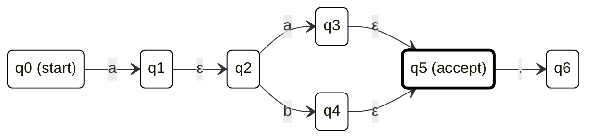

```ts
{
  accepted: [false, false, true, false];
  histories: [["q0"], ["q1", "q2"], ["q3", "q5"], ["q6"]];
}
```

`accepted` をみると、各入力文字を読み込んだ時点でそれが受理されるかどうかが分かります。上の例では、二文字目まで読み込んだ文字列 `aa` が受理されていることが分かります。また、`["q3", "q5"]` に受理状態 `q5` が含まれていることも確認できます。

以上で、NFA の構築・実行のための型を定義することができました。

## TRegExp

これまでに定義した型を組み合わせた集大成の型 `TRegExp` を定義します。この型はパラメータとして正規表現文字列 `RegExpString` を受け取り、字句解析型 `Lexer`、構文解析型 `Parser`、NFA 構築型 `NFABuilder` を順次適用して `NFA` を得ます。

```ts: tregexp.ts
// 正規表現型
type TRegExp<RegExpString extends string> =
  TRegExpInternal<RegExpString>;

// 正規表現型 (内部型)
type TRegExpInternal<
  RegExpString extends string,
  LexerRes extends LexerResult = Lexer<RegExpString>,
  Tokens extends Token[] = LexerRes["tokens"],
  ParserRes extends ParserResult = Parser<Tokens>,
  Option extends TRegExpOption = ParserRes["option"],
  AST extends ASTNodeRoot = ParserRes["ast"],
  NFA extends NFABuilder<AST>["nfa"] = NFABuilder<AST>["nfa"]
> = {
  readonly string: RegExpString;
  readonly tokens: Tokens;
  readonly ast: AST;
  readonly option: Option;
  readonly nfa: NFA;
};
```

## TRegExpTest

`TRegExp` で構築された `NFA` をもとに入力文字列 `InputString` が受理されるかをチェックする型 `TRegExpTest` を定義します。オプションについての処理の説明は省略します。核となるのは `NFAExec` が返す `Result` の処理で、入力境界アサーションの有無によって以下のように処理を分岐させます。

- アサーション無し: 入力文字列の各文字を先頭とみなしてそれぞれについて `NFAExec` を実行し、いずれかの `accepted` 列に受理状態が含まれていれば `true` を返す。つまり、入力文字列の任意の部分文字列について `NFA` を実行しています。
- 入力開始境界アサーション `^` あり: 入力文字列についてそのまま `NFAExec` を実行する。
- 入力末尾境界アサーション `$` あり: `accepted` 列の末尾が `true` の場合にのみ `true` を返す。

```ts: tregexp-test.ts
// 入力文字列が正規表現型に合致するかチェックする型
type TRegExpTest<
  InputString extends string,
  InputTRegExp
> = InputTRegExp extends TRegExp<infer _>
  ? TRegExpTestInternal<InputString, InputTRegExp>
  : never;

type TRegExpTestInternal<
  InputString extends string,
  InputTRegExp extends TRegExp<string>,
  InputNFA extends InputTRegExp["nfa"] = InputTRegExp["nfa"],
  Option extends TRegExpOption = InputTRegExp["option"]
> = Option["anchorStart"] extends true
  ? NFAExec<InputNFA, InputString> extends infer Result extends NFAExecResult
    ? Option["anchorEnd"] extends true
      ? Equal<Last<Result["accepted"]>, true>
      : Exists<Result["accepted"], true>
    : never
  : TRegExpTestWithoutAnchorStart<InputString, InputNFA, Option>;

type TRegExpTestWithoutAnchorStart<
  InputString extends string,
  InputNFA extends NFA,
  Option extends TRegExpOption
> = InputString extends `${infer Head}${infer Tail}`
  ? NFAExec<InputNFA, InputString> extends infer Result extends NFAExecResult
    ? (
        Option["anchorEnd"] extends true
          ? Equal<Last<Result["accepted"]>, true>
          : Exists<Result["accepted"], true>
      ) extends true
      ? true
      : TRegExpTestWithoutAnchorStart<Tail, InputNFA, Option>
    : never
  : false;
```

これらの `TRegExp`, `TRegExpTest` 型を用いると、本記事冒頭で示した動作が実現できます。

```ts
// 正規表現文字列から TRegExp 型を作成
type EmailRegExp = TRegExp<"^.+@.+\\..+$">;
// 正規表現にマッチする文字列であれば true 型になる (ValidEmail: true)
type ValidEmail = TRegExpTest<"piyo@hiyoko.com", EmailRegExp>;
// マッチしなければ false 型になる (InvalidEmail: false)
type InvalidEmail = TRegExpTest<"piyo.com", EmailRegExp>;
```

# おわりに

正規表現をはじめとする形式言語の定義方法からはじめて、TypeScript の型システム上で動作する正規表現処理系のつくりかたを解説しました。本記事を通して型レベルプログラミングのおもしろさを少しでも感じていただけたら幸いです。今回の実装内容は [こちら](https://www.typescriptlang.org/play/?ts=5.8.3#code/PQKgBApgHghgtgBwDYTCYAoDxhkMbWg8ZGAWEYH-Og4aaDq2oOhKg0gyCRDGACoBKEA5gKJQJiDR6oEkMgHXlACEYYALgE8EqDnBgBLJK07cwAXibKuCADwAiAHoA6ANQABUwB1LR0wBI9APgDc2XIVKBrBkB7DIGGGQIMMgJoMgNEMlFSA5gyAQgyAMQyADgxgYgBOAK6ovJ6AVgzBYAAUAGowSPIAJrIKSABcCSkQAJTiUqgFRaVyiuqa7NqMEADOYvoI8hIA9mYAFsMjANYjRgDGI3B6ADRgZYpa3C5uYH7+gOoMGYCKDHFgAGaFvWmZ2TkAkgB2AG6FJRuVF1d1DdJgT68Wh8Oiwutwev1BlMFktVus2kowQgdlhsOBkmJFL00JhfqgACLyc7nHQAZUgUDEEEexWxyUe00eIwA7o8ANoAXTWjApVJpdIZTNZnMcHUJxKeVMSj0KZO5KMkf3F50lEGlsowYDA5OgfNpYHpjJZ7K5mqYvOp+sNQpNKzNrF6ySQYgt-INguNnI6nIwoo0OspluxbPkj3OarAAAkIDBimtbEZQ+HEkxyhyzQB+dZQeT9Xo6RhraOx0W6oPVVJmrVZ5Wq9VIAvlblrB1OsSOKtgKq1x5SmUNxhNphrNkJ1vOosx4ocjtaqrjsSuPHrACOyVlAA01gBNP25AuOHK1dSinllt0bsBZgCMXbAACZj+f9TozYxfUeT+bn9jt1ewLeVT3pmFYQGaVSXEg1xLoqMg5nmBaulaHrClyYAAKp7megZumyZpJhGxZxmaCYESmg6KBg6bVqu64NkRayYUh2JJJWWo0axYHsXeXC5mI+YUUgjGznekHQVgsH-L2arXPMmIjI8r5agGeoCkaqF2lq2Gqe66kmr6HR1rJ8mPHW-ZykwCqNFJUrGfIClmRqynMbpNqcpp344chenufafRti51qehy3rpnuKnliGYaEVO8a2GRqaKNR-68QhhZRlOpZeSxNSdlmRkQHJ9mmdJ9aNoozZgKOtgLpOsYzp2VQFUVDmleZgmVQuInzv5zowdZAAyMCQtp5ZBahWEudVibRSmAD6awJUN-TJVmy1iOBYCPBAzxqv1fzoY88hrhAiE-q5wV7odx2pI5A5WQdR0nXdSmeTp422n5jrOoFKEmqFBkaKNuEJQxYCkbNiVIKtGWxi5C5so8yRwAARmqyU0ddz1tbKHVgF1jUYU9t04wOQ7TbVsPTt1+O9YuqJogkMzUjiEnWYwzOPB0ADeCSNFU-SJKGbBgAAvvtqAc9M1IDQACjAiQs0DnNgAAZGAvOwVUehywAgswHAAHJ6GLriSVL1LMPLitc8r0tc+rmv82AehW-rRsm+Ly4W4810KSCKuO3z0ja+hhv3AA8sbpve5zstIMk2J2yzQday7ssDehpKe2b7Oc6SYgKwH9tqxrwcQNrpKMPrOex-bEcICZxcp2Xad6BHsuMJH0de+bnP4iMLrJw7rfO3o+IR4wtd9-bADC4wKzos8uYLwtYYHo8hy7s+RjXzhgPMC+JFUy+93n9u648h8jIkBcK0PTAb07W96Lrhs7xHzBzVX+tTzHM-UkvtfRIHAaTNxHs-CuLs34fy-kbfEtc67UgALIwB4BobmZo9A5D0FUH2csFbUlcFqPQtRcGP3tlbQhjxiEuwAD7kJ9n7GhWCTCMLjgnXotC9AgHYfbO+iRuEZj4dSBuJluFGBEY8Ae9MSEGCkUA8YN8BGyLAHYPBnNFE31AcUVwXtUSgDACgKAEZ0Bsz+ANaAaoyQrySGvDoliTGJBeqSB6qBHFqhemaCKbpV6PDYB5H22Jzo+y9BoH04UXIAAM7Dc1BlOUWsSEqCVFlEkCREXLS1GOcChKC0F5TAB45xpNypCSqgmIJ3JOaoIQGyIiHIGrcSqBk86ehrB6AKYJaJSTIYcF6PMNBEBijzwVokuJvT+mDOKCktJ3EaJFJen0gZ0hpnkwqZzXoVS55Hx0EsqZIzEiOEaXMqo21dqJEJi07KYA-FsAKQskpeNpqVNyY8A5OgiJHJEnOLaO01SbUwXMpm9tegaJBbQrU+jJJFIXDzM0YgNlgupJyPRS4sCGOGi6Mxy5dZV0NiMYoqAMFgBKALOx-j95p1uTHHFeKCUQGYCMQe9xigdD0AAYj0LnP4uLGD4sJYyweS9JhIFZedXl-KiVgAlfSvcMrCWl0BSS4oVR5UMqZWIFltC27MAjpPLlZpD6KBVWAeexrUXmNQGq5hLKdDW2pJqsV1y1Vsj0CUPQM4OgxO5va3sLLRbJCidyq1dLCU2uKANO11DHUuRdW64oHq9zet9Y6gNABaJAQbaV8vpeG5gUabYxvFaGiArr3Weo0Mm6N-rkhpsSFmyS1qjoKVeimllsaS1loTSFDQcby0eQGma0VHac0Kt7SWjyzAh1Op0mqjoarAbSpLYq-CJqm3FVtW24oOwtRtzDt3A1WoUDnDEFUQdIrdFmiFmwcYp78bTotdmyVs8FIDMdQWh17bi2jtLfGxNXrYlbtFvMBt1k1UvqvjAR1kat0jslV2-9lbAPVuKMBjNoGeUlog2+ll+bYPfvg3+itYAq2Fv9fMOtGGQ0-uw1B1tKG4P0oQz2pdP7mMDunYxsdrHJWTs4wR+l86S2LrnY7VdqqsOvqg5ulDO7y7a1nlHWeusp60OPXe895qr3yBvXeqdF7H2NpLfHROMmyMzvLH27tSbkPmdFggKjPH6UmfzGafDzrO1EaE2xojHl+MeZ-d5yVInl1ia1KSpzhKXNmc-du7VY8M5Z0PQfC9J8DMYChWBktAiYt+os26KziGSO2di6LXojm1UCPo+Zrjv7y1BaY75s0-nZ3LvHT+kLgWwvKokz+nLxQP15bk23H+zBktGtFWlrTmXMM-rERugb7nWs+fLTZn1KHRYjAqyW+bLa3MMYE4S5jDWjtNa1C1yzbXItgTlaFjW4nru7dMot2T8WX4dy7lHcbqXTXpZm9RyVMjctFoC4R1bAH1t2eKNtn9MjBsg+W2D7tJ26vWfUGaUT93uIRbVUDl75m5O7rHhPVTZp-vXYOba-bNXDuo49X5o+tihb+MXaR0rFHYkHNFmmmHz6dnU9i7V477Wkf0+a4z861KNC3M65Kld4W11YaPsDllawDnDbHjvPehqj5pYVoZrLP7rbXA4IkRIN8Ufy56y7dlapzeJGS23DgzBdVjcfei8ACAFbXBTNiySxvrFBJcqEit1PrhPYLBsrKOkEoB6e7C86Srd2IteSizsIxG7FTwVsBAT3aGiwKUnuZmLeuSsFQMTsQKA-MO0IkHQary+q7AHHzPCkEZ6ARSCxNlf2KE7mRnkyVQW8mXbwP4qHqIXsQL00355yJbN+92qWFGCzQl+u+X2hY+FLZ6RHnjL8-h-FVekHkJnNfJaie8HnPl+MEF-XiCqaPstG30LokMQcUZrJlpv0YPZ+GkgUPxbQdHfzAEvyDhgCviURf3viqE4jFhphP2uWmgSmAN-3tncleWfx0RhkAMUmALWDALLggOAR0VgJqHgIBR7072pFBVeS4R7y30eCqD324n0RwDAB0HpGKjTWgAQEOS7AqA0B0EWEgzEB4O4H4P3Sjg4K4IUnEL4NFDoQ4JELfXkMOWXGr2bUeFr2q0F0l3JQCTfA2TQORVNC1EsRPUQJ0hDwBnvxoKmniThlP3tg-2SXKBMJNBhjwir0X1ozEB0PXQcgjXhxZUcDWAsLECCTCJ7wYh700OKgCJLTzRCO3W5HKG+TABCnOm8LmVj18Kk38IkIT1B3pQ8m4iYS0LKPYjyMSGuBryKLplq07Axn-DZADz8Nr0pniIUk6LpiyOyh7y1CULZDVQD1N3tzWA+haO4mGI+jWFGMX3GJvmmP-G6O0IkJSLSIqnKVsAiJeXqQyJ+UCMUi3TWHaIKN6O+hALWMuLbAyKH0X3qL4M2KhhHATD2I2Tqmpk2nONEJ0NOMKQgEsKjyXHYOEIKLUNFAqEEI4OQETkhOUIhN4P4KUJ0DhN6EhI0PyL+I2IFzyyZ2FkCWMOcNMIHSBMiOJOuRsPCTCnAWCSQMcPy31B9lcMhi6RJM8JAhyO4gDxc0SJowKJZRg1kzeN2PJP2KnBnCqK1F+LfX5OfUFOKDwxFKhgyP6J0m5OqMhl5M4VuJ+lp2lJJW1OxLlIaKuKaO4haKzDaMXz5LNLbDOJNKgz1LEHVKDEGLAGGIWNqIgCWMSEmL+hWKGKqjmOuzGLN2WJ7yzFlOdI2IBKeXePFM+KpmORn3AwKJeJ1MThdMdJ9I6PtOdHuIXzzIuLjJQy2LKWmg+JBS+OOQeJ9LtOeIBOrJoJRDBPRIROhKEMuDkhvgRMS3JFRP6AVkxP91tN1NxJlIO2uVuSJIfw5IiTpKmghi-wADEYBezEgrDywQ8tlqQXMcDF91zNydCe9RjOEVdUie9jyEUtyNlOxo9ywajrgbztECyXRacCkA9XyQF3zatwz7cozizrgBF-jyy6DDi7xzzE5MyjyNzbyXSiyA9QKyzzM9zHhegaZkLX8wK0KILQTcAdBhzEhOyYSdAezbyETRtPSODGDRzrJsKFZTypyacZyDC5z7CFzaTh56SNSVyIwfzty3RdzXkBFDyfSfzmK5lKtX9LzoigVBL7zuJHy3RnyIBJK-zPzuJoy4KTzNKSiotFiIyLkgUdKfSntcLYt0LMKe9S96UqsATvz4K3y+CCYZ9cDLK8trKsLF8LLUKrL8L0VCK6LkSoSyKKK+zQrQDO5u4aLyLnKSLQqsTzLW91jni8SEdyxZyjD5yqS-9F0hL9RkDIZFLcrrC-90KntxKXyEqpLuI1Uns5LDTSqaCHyXI1KNLXLGitL2IzKaq9KurzTacAKb4gKnKBq694yo9bLHtUrYKJLar3ykLdKEL-KvKIKfiVqXLJrwKoiCKOCIrEqJCwqNA9YDZDYZCtCES3ZzqaKScaKtdmAcgoB6gxyFqJrdD8T9DmdDCtJKTyr0DuK6CpocqZZfUPJ+KUxmFCrsRdzQbHgqEbYqIQJob-rIorSKcdkAS9AnBCYbi1rHVGItCojNoYaqofYZEYZcchUt0EC0bcIfZ3kEoDkCT-EjkQJwMsbwL1dNpvSTdjK0VGYwwYBWZlxDZVzcVC4qQOhblg11gEBegWaNAkYkAkB59xaVNEgIDeh5Am4V8tRzhzc4AqgNa74qRtURgTaJazaIBaFD4FYyUfqaKOAFaDkDc-gNa4UtRhyqRaDTapbS0ORtUtaMLdbio-aJbGAQ6daTI09vbX871-aoNbbV95h5gIBG4rbJbk6099EPctpLg00UZkhjVTFcRJINaAAhEu0VaxOXWncvPcJVYWrO6u0u4pPsWUSVHYcnKumuwlRIZfLHAumALO921APu9ul6eugyiAPcGexHelcvECSe2ujutUcyQjCbazTaBey7H9ZhFeiWtute5hHQbu3ewTWnPwo+3WE+gevw8+2VS+hVYazhW+++tUFzJ+wlGmPegrbLV-D+-utUKrC+n5f+-UBq1K4B9uiPcBu8SB7EamjaGiVegeuHBBk2q+2eg5WBte95LB2fPaS1MAdBtUM+s0JB67ZhAdT286T2jQch9esqQjdTRNSdeh65Rhsh4+kBlhzexra9W9bvJus0H2voKoKsjW11CR3oencGGqGRvQORhR71UXDkUWMwAABiiSDvhWjrDoUloM1PeOUaSG1qMYwrF24jHHMcMZMnkbMPYl5kNqWCqHUca3LS0d0cpUtsKWUeIrEAnxSwdvlsVsZ1FiqNcaNo8diQ0Z8aDSZnnECYTpCftuPnCZZun0yNoSCbie5gSZ0azS1A3PTszp2KMAGmUbKYzuCbQjsYltdVqcbg9X0d7r4fbsfqoZwcXsJT8LoYlpch4eYensa3YalPtC4Z0hGc6bXrGdO2EfqY7DEfjuTpMbMaaZUYDqcY-2YFSfWbaeDssccakc7E2d1ldQsdDscZsfYkacuY7wcfDrua1AqWeeMdXKNptvzGqa2ZafqZbAObfwUZdoiYVhEn0bWbfzPWBfqdoQBZSf+bTrqYn331IeYe-p6dftnpcz82mfLFmbvv4YWd-W3tEa9puR2ZPgOd9rRd3Q+YwrOdsdsFnnsZOZeecbedsCjo5c+e+Z2aXhqZRdabQjZa2aCdBddqPkhbyYTppYlbSahbAERdNWFfKfhfRbFrmYHqq2xdQFpwEXxaGYYaGaYZ1c8RKS3ovQpf1qpfWYVcedUeVeuZjvDuZfudZfZZuc5aqPeb5Ywq+aWB+aFeRY1YUfFadaVbWDBZ5q1GVfybVcVfvnpZVZFbvWmkjeafTYjbhaOa1YrotcSAj31dqye2Nd1mGbNd4eJanqtca3JYalWftd9sddkZ2dTddasdoKzaeYDacblZgKTajZTeVdVczfVdRbFbzYaXHprc-sSEwd6f3sB0Hmbbkakc8dO28eKbWC3bp00bMGvD0eOZ9eMY9a1CLwNtieK0Ka8e7UScn2TwKaKePafdCcydls7ByYTfldvaKd8dTo1c3fifvY9S0ePfafVqLcIeXYAZoxlcpY3aqn3eY0Sb3dA+3YfaPZPYMf7YveHu4jceNv-bA8PcA6BQRRfbI4g5KbmQyewdOwydTchTNF-aHdQ6I0faA7qZA7vaw-A5w6g9Id5bPcDYFfWdeiDbgB+arezqpHP0fhtrk5toZyLlNc1oDddWY6BqVTZCeEJSgCNLACyRGByWk5+Y5CqCL2I6qAs52f05pGgGVefaU4DsnwY9+31zJ3dyFsLqsXmFFsLd1i4EKleieAQAxAJbdA1o8gi4xALidu+uFkXQ1tC-mBeni7EFi6kki7EES7Xmg5C5MXmCHqVQBaGSqBRiZRQAgLjrAEmH6BvnkEkZrZts5FzqK-S68S1Cy+i-1Fi7NCy4K-8VZt+u1B2ZU4DrCSqj6+TZBYaQ8l1nTaGRcmq5GFq-+hpI8kjD4ma76Cm5zo5Bm8XI0GG4MO6XGS-yIjGTcMUFSVvu65KR7zm91kNI6h70Nl1B+YAHVdbxgwXFAFJZ4kARhHRFYyQdmvi1hXurnGWnH5K5lppluNWhkYfegUe6mhlIf1mYfHg8uNajlDTppdumuhY+g1hLOHzKCgUKuTVkeVu4x-gMfGecffa8eCeJajl33GvbyWuNnbBSe+eKeJv1mXOaVJJ7gWfUeBtZONP2u0JXu5O9xmoTJXofm4v8eouw2p2DJsiYYxIuI7xOJ1bvudm-uxAAeFage3lQfwfTozR7P1nDuFPnGWbkv-FAl4e5PRO3WFJTvwmbeQewfkgIeqGzf1mnffbXotRAfQfbeQ+Ieo+Rfffu3Efzsj4qjU-HGzREfs-w7fR584-ge7fQ+HetRk-eLCXrbpvnH8-jGffGWA-i+E-7eXpK-uR4e3FA-4-g+2-nuK+JPfaXfA6vf+3G+tPnHiiZma+juOhK-F1K+QbwtIYrkZ-5OIAIb4o2T3D5fa-ka0GI-faLPhYUAbaY-2JYigVY3M+e96+MK2rzoUCYx7aUYz-Ju9+juCkW+++y+eugVKmeMBMMqB0CsANyC8N-hAA17f47iXLOZPf02QekKYdMPZi-wgHv8xePeIsj-1L6KwXoeMBAS2Dpg0wsYqQUAcQNN6UgfmlfKTkPwO6f9XeanFMB7xFhKEb+CsMfmJyr4xdI6TfIGl9yoE7NK+7fOgZsi87+kmAXfSgflyEGiD-+S-BgaP3Fzqc2KTtNgdKw4FvhveGne-op2n7V8N+J3IGgoKQL4RV+U4Eflv0-wRh2S3DWfq7wP7-gBBMgyPt81P5QCA6F-LUFfzmQHJ3u8PR-tcgSjOC5edgwwRjRCGyDg2Ozf-kCg+4ADxBhpLSPDySGVNKYCYSIZgKBRFlMhx-OQY8iHB+DJB-bIgVcRIHExToXUaQdQLcH+IMBVIWgdEOTqWDlBzA1QcLGdoaD-SWg8fjoL4Gpcj+fQE-nUI8HJ0RBTQqkGrkz7FCuB3fXIUMNqFsB6hEAeQXQJaEZ8VBOkalOoPBbdDkhvQsIboKn7dUwhCvWwiCG0GmCV+13CwX0IDZWC7uSACfmJx9BeFk+UwhWG6VwhERXUxHBRj8L0A6cIhgw3oMMKWGjCqQsQuZO8I9J+CPS8QgAcgKuJfErmIwNplgMJjzDQRiw5YeMJk4B0PhEgvGG5TvCkDKhFAhmIYiSDsBeCQXdmDnnIEqAEAI3EWCwL9Bvgc8L0HPCyO76ggmR--bkRdxYFkknEDoFyDCkaKnUrEdeQUT9Tz701mSf+BxNKIdCoiu8zjAPIPXoHXJNRQ9TUZHhBSI9L8ISa-KlQ6C6i+grqRgnc15S1Zy85oxfFqN6DNN+gdzfrtiGYb14q4jgV1MLQ9QdBPRvKH0XoD9G6cr0U4BSEgAkBUsfqPUJkSyNoSKxYwkY6MdQSZZ0FExEYx4FGJVb9BesmY5MdmOjGMFmCqVAscUBTEj0x6WrfOtSLYC8E00jBOkX8D5HaAb8w9JMRWKLEqtICyiBOhmCq41cYwNCMAOwQMDhjCxOY4glAR0QDiwA63TbvvHYJ2AtWVIxWPWO4BppfaWKXELwRvguhzYOeCEBXl65a8ZBSXdoZ7yG5njWx3ARdFl1vE8ATRSIHQAlDmgiQswj448ZlzPEsiOeGIR8TTDOQkNvYR4voJqgH65cEuQoy8eNwfE54r8L425IjyV7nR4JSIX0ZcH9FncbxOeTCTADubGiqSpovWlBMiJ4S9A1ooGk9maa9joCC3FyJxEe4lcdAr3f8eePsRP9IY+gngcV0KgLgCkNEvQNOO0Q0h-R50JiaZVoiyh1o5Aq4tmxl4cNQIkFKoKlH4hyS2wCkrHt2jWCcQiywEkyneC-HgSLeSiDEM-hUSsTfx7FMiTlyey8iwJ-QUySMHMl0TLJ14vLiyLG6a9OelbDTh5CInWESJxUe8dZIvE6RvUjJW7jv3u6zInBEtdLlZN8nsSeR7VbiScPX7pcBJ2lXIB6SEkiSQEYkr4fqEkkJCUoa4GSZig0nOgtJjcIZEpL0kekfkak-MO3jp4KNGpQKJ8NclKk5Tep7EHfEyOPHOTXJwCSyXjDYmgFUq+kv5IZIgjfBXAQAA) (再掲) で動作確認することができます。
